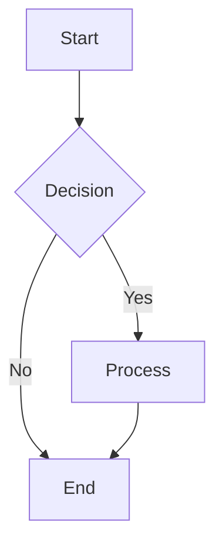

# Advanced Chat Components Template & Integration Guide

## Overview

This document provides a comprehensive template for implementing advanced chat components with full markdown rendering, presentational displays, and interactive features. Use this as a reference for creating new chat components or enhancing existing ones to fully utilize the sophisticated markdown and UI capabilities available.

## Core Architecture

### Component Hierarchy

```typescript
interface AdvancedChatComponent {
  // Core rendering capabilities
  markdownEngine: AdvancedMarkdownRenderer;

  // Presentational display system
  presentationLayer: PresentationalDisplayManager;

  // Interactive features
  interactionHandlers: UserInteractionSystem;

  // Performance optimization
  renderOptimization: PerformanceManager;

  // Accessibility compliance
  accessibilityFeatures: A11yFeatureSet;
}
```

## Essential Components Reference

### 1. Advanced Markdown Rendering

````tsx
// Core markdown component with full feature set
import { ChatMarkdownViewer } from "@/components/chat/markdown/ChatMarkdownViewer";
import { AdvancedMarkdown } from "@/components/markdown/AdvancedMarkdown";

const MessageWithAdvancedRendering = ({ content }: { content: string }) => {
  // Detect complex formatting
  const hasComplexFormatting =
    content.includes("```") ||
    content.includes("$$") ||
    content.includes("graph") ||
    content.includes("mermaid") ||
    content.includes("flowchart") ||
    content.includes("sequenceDiagram");

  return (
    <div className="prose prose-sm max-w-none dark:prose-invert">
      {hasComplexFormatting ? (
        <ChatMarkdownViewer
          content={content}
          features={{
            codeHighlighting: true,
            mathRendering: true,
            diagramSupport: true,
            tableFormatting: true,
            linkPreviews: true,
            mediaSupport: true
          }}
          onCodeCopy={(code) => navigator.clipboard.writeText(code)}
          onLinkClick={(url) => window.open(url, '_blank')}
        />
      ) : (
        <AdvancedMarkdown
          content={content}
          className="standard-formatting"
        />
      )}
    </div>
  );
};

// Example usage with different content types
const CodeBlockExample = () => (
  <MessageWithAdvancedRendering
    content={`
Here's a Python function with syntax highlighting:

\`\`\`python
def fibonacci(n):
    """Generate Fibonacci sequence up to n terms."""
    if n <= 0:
        return []
    elif n == 1:
        return [0]
    elif n == 2:
        return [0, 1]

    sequence = [0, 1]
    for i in range(2, n):
        sequence.append(sequence[i-1] + sequence[i-2])
    return sequence

# Usage example
result = fibonacci(10)
print(f"First 10 Fibonacci numbers: {result}")
\`\`\`

And here's a mathematical formula:

$$
F_n = F_{n-1} + F_{n-2}
$$

Where $F_0 = 0$ and $F_1 = 1$.
    `}
  />
);

const DiagramExample = () => (
  <MessageWithAdvancedRendering
    content={`
Here's a system architecture diagram:

\`\`\`mermaid
graph TD
    A[User Request] --> B[Load Balancer]
    B --> C[API Gateway]
    C --> D[Authentication Service]
    C --> E[Chat Service]
    E --> F[AI Model]
    E --> G[Database]
    F --> H[Response Processing]
    H --> E
    E --> C
    C --> B
    B --> A
\`\`\`

And a sequence diagram showing the flow:

\`\`\`mermaid
sequenceDiagram
    participant U as User
    participant C as Chat Interface
    participant S as Chat Service
    participant AI as AI Model

    U->>C: Send Message
    C->>S: Process Request
    S->>AI: Generate Response
    AI-->>S: Return Response
    S-->>C: Formatted Response
    C-->>U: Display Response
\`\`\`
    `}
  />
);
          className="bg-transparent"
          features={{
            codeBlocks: true,
            mathematics: true,
            diagrams: true,
            tables: true,
            customComponents: true,
          }}
        />
      ) : (
        <AdvancedMarkdown
          content={content}
          options={{
            sanitize: true,
            highlight: true,
            linkify: true,
          }}
        />
      )}
    </div>
  );
};
````

### 2. Multi-Turn Summary Component (Enhanced)

```tsx
// Enhanced multi-turn summary with structured data parsing
import { Badge } from "@/components/ui/badge";
import { Card, CardContent, CardHeader, CardTitle } from "@/components/ui/card";
import { Progress } from "@/components/ui/progress";
import { Brain, MessageSquare, Eye, TrendingUp } from "lucide-react";

interface ParsedSummaryData {
  turns: number;
  entities: string[];
  topics: string[];
  contextQuality: number;
  relevanceScore: number;
}

const MultiTurnSummaryTemplate = ({
  summary,
  metrics,
  className,
}: {
  summary: string;
  metrics: RelevanceMetrics;
  className?: string;
}) => {
  // Parse structured summary data
  const parsedData = useMemo(() => {
    return parseMultiTurnSummary(summary);
  }, [summary]);

  return (
    <Card className={cn("border-primary/20 bg-primary/5", className)}>
      <CardHeader className="pb-3">
        <CardTitle className="flex items-center gap-2 text-sm">
          <Brain className="w-4 h-4 text-primary" />
          Multi-Turn Analysis Summary
        </CardTitle>
      </CardHeader>

      <CardContent className="space-y-4">
        {/* Summary Statistics */}
        <div className="grid grid-cols-4 gap-4">
          <StatCard
            icon={MessageSquare}
            label="Turns"
            value={parsedData.turns}
            color="blue"
          />
          <StatCard
            icon={Eye}
            label="Entities"
            value={parsedData.entities.length}
            color="green"
          />
          <StatCard
            icon={TrendingUp}
            label="Topics"
            value={parsedData.topics.length}
            color="purple"
          />
          <StatCard
            icon={Brain}
            label="Quality"
            value={Math.round(metrics.contextualRelevance * 100)}
            suffix="%"
            color="primary"
          />
        </div>

        {/* Quality Metrics */}
        <div className="space-y-3">
          <QualityMetric
            label="Entity Overlap"
            value={metrics.entityOverlap}
            description="Consistency of entity tracking across turns"
          />
          <QualityMetric
            label="Topic Continuity"
            value={metrics.topicContinuity}
            description="Coherence of topic flow in conversation"
          />
          <QualityMetric
            label="Contextual Relevance"
            value={metrics.contextualRelevance}
            description="Overall relevance of retrieved context"
          />
        </div>

        {/* Entity and Topic Tags */}
        <div className="grid grid-cols-2 gap-4">
          <TagGroup
            title="Tracked Entities"
            items={parsedData.entities}
            variant="secondary"
            maxDisplay={6}
          />
          <TagGroup
            title="Discussion Topics"
            items={parsedData.topics}
            variant="outline"
            maxDisplay={6}
          />
        </div>

        {/* Expandable Details */}
        <details className="group">
          <summary className="cursor-pointer text-sm font-medium text-muted-foreground hover:text-foreground transition-colors">
            View Detailed Analysis
            <ChevronDown className="inline w-4 h-4 ml-1 transition-transform group-open:rotate-180" />
          </summary>
          <div className="mt-3 p-3 bg-muted/30 rounded-lg">
            <AdvancedMarkdown content={summary} />
          </div>
        </details>
      </CardContent>
    </Card>
  );
};
```

### 3. Presentational Component Selector

```tsx
// Dynamic component selection based on pipeline output type
import { useMemo } from "react";
import { motion, AnimatePresence } from "framer-motion";

const DynamicComponentSelector = ({ className }: { className?: string }) => {
  const { docs, metrics, multiTurnSummary, tokens, tools } = useChatStore();

  // Determine which components to show based on available data
  const activeComponents = useMemo(() => {
    const components = [];

    if (multiTurnSummary) {
      components.push({
        id: "multi-turn",
        component: MultiTurnSummary,
        props: multiTurnSummary,
        priority: 1,
      });
    }

    if (docs?.length > 0) {
      components.push({
        id: "docs",
        component: DocumentSources,
        props: { sources: docs },
        priority: 2,
      });
    }

    if (tools?.length > 0) {
      components.push({
        id: "tools",
        component: ToolOutputDisplay,
        props: { tools },
        priority: 3,
      });
    }

    if (metrics) {
      components.push({
        id: "metrics",
        component: ProcessingMetrics,
        props: { data: metrics },
        priority: 4,
      });
    }

    return components.sort((a, b) => a.priority - b.priority);
  }, [docs, metrics, multiTurnSummary, tools]);

  return (
    <div className={cn("space-y-4", className)}>
      <AnimatePresence mode="sync">
        {activeComponents.map(({ id, component: Component, props }) => (
          <motion.div
            key={id}
            initial={{ opacity: 0, y: 20 }}
            animate={{ opacity: 1, y: 0 }}
            exit={{ opacity: 0, y: -20 }}
            transition={{ duration: 0.3 }}
          >
            <Component {...props} />
          </motion.div>
        ))}
      </AnimatePresence>
    </div>
  );
};
```

### 4. Enhanced Document Sources Component

```tsx
// Professional document source display with metadata
const DocumentSources = ({ sources }: { sources: SearchResult[] }) => {
  const [expanded, setExpanded] = useState(false);
  const displaySources = expanded ? sources : sources.slice(0, 3);

  return (
    <Card className="border-muted-foreground/20">
      <CardHeader className="pb-3">
        <CardTitle className="flex items-center justify-between text-sm">
          <div className="flex items-center gap-2">
            <FileText className="w-4 h-4" />
            Context Sources ({sources.length})
          </div>
          <Badge variant="secondary" className="text-xs">
            {sources.length} documents
          </Badge>
        </CardTitle>
      </CardHeader>

      <CardContent>
        <div className="space-y-3">
          {displaySources.map((source, index) => (
            <div
              key={source.id}
              className="flex items-start gap-3 p-3 rounded-lg bg-muted/30 border border-muted-foreground/10"
            >
              <div className="flex-shrink-0 w-6 h-6 rounded-full bg-primary/10 flex items-center justify-center">
                <span className="text-xs font-medium text-primary">
                  {index + 1}
                </span>
              </div>

              <div className="flex-1 min-w-0">
                <div className="flex items-center gap-2 mb-1">
                  <div className="text-sm font-medium truncate">
                    Document #{index + 1}
                  </div>
                  <Badge variant="outline" className="text-xs">
                    Score: {source.score.toFixed(2)}
                  </Badge>
                </div>

                <p className="text-sm text-muted-foreground line-clamp-2">
                  {source.text}
                </p>

                {source.metadata && (
                  <div className="flex items-center gap-2 mt-2 text-xs text-muted-foreground">
                    {source.metadata.source && (
                      <Badge variant="secondary" className="text-xs">
                        {source.metadata.source}
                      </Badge>
                    )}
                    {source.metadata.timestamp && (
                      <span>
                        {new Date(source.metadata.timestamp).toLocaleString()}
                      </span>
                    )}
                  </div>
                )}
              </div>
            </div>
          ))}
        </div>

        {sources.length > 3 && (
          <Button
            variant="ghost"
            size="sm"
            onClick={() => setExpanded(!expanded)}
            className="w-full mt-3"
          >
            {expanded ? (
              <>
                <ChevronUp className="w-4 h-4 mr-2" />
                Show Less
              </>
            ) : (
              <>
                <ChevronDown className="w-4 h-4 mr-2" />
                Show {sources.length - 3} More
              </>
            )}
          </Button>
        )}
      </CardContent>
    </Card>
  );
};
```

### 5. Processing Metrics Dashboard

```tsx
// Comprehensive metrics display with performance insights
const ProcessingMetrics = ({ data }: { data: ProcessingMetricsData }) => {
  return (
    <Card className="border-blue-200 bg-blue-50/50 dark:border-blue-800 dark:bg-blue-950/20">
      <CardHeader className="pb-3">
        <CardTitle className="flex items-center gap-2 text-sm">
          <Activity className="w-4 h-4 text-blue-600" />
          Processing Performance
        </CardTitle>
      </CardHeader>

      <CardContent>
        <div className="grid grid-cols-2 md:grid-cols-4 gap-4 mb-4">
          <MetricCard
            label="Total Time"
            value={data.totalTime}
            suffix="ms"
            icon={Clock}
            color="blue"
          />
          <MetricCard
            label="Documents"
            value={data.docsRetrieved}
            icon={FileText}
            color="green"
          />
          <MetricCard
            label="Tokens"
            value={data.tokensEstimated}
            icon={Hash}
            color="purple"
          />
          <MetricCard
            label="Efficiency"
            value={data.efficiency?.toFixed(1)}
            suffix="ms/doc"
            icon={Zap}
            color="yellow"
          />
        </div>

        {/* Performance Timeline */}
        <div className="space-y-2">
          <h4 className="text-sm font-medium">Pipeline Timeline</h4>
          <div className="space-y-1">
            {data.embeddingTime && (
              <TimelineStep
                label="Embedding"
                time={data.embeddingTime}
                total={data.totalTime}
              />
            )}
            {data.retrievalTime && (
              <TimelineStep
                label="Retrieval"
                time={data.retrievalTime}
                total={data.totalTime}
              />
            )}
            {data.rerankingTime && (
              <TimelineStep
                label="Reranking"
                time={data.rerankingTime}
                total={data.totalTime}
              />
            )}
            {data.responseTime && (
              <TimelineStep
                label="Generation"
                time={data.responseTime}
                total={data.totalTime}
              />
            )}
          </div>
        </div>

        {/* Multi-turn Metrics */}
        {data.multiTurnMetrics && (
          <div className="mt-4 p-3 bg-white/50 dark:bg-black/20 rounded-lg">
            <h4 className="text-sm font-medium mb-2">Multi-Turn Analysis</h4>
            <div className="grid grid-cols-2 gap-3 text-xs">
              <div>Turns Analyzed: {data.multiTurnMetrics.turnsAnalyzed}</div>
              <div>
                Entities Tracked: {data.multiTurnMetrics.entitiesTracked}
              </div>
              <div>Topics Tracked: {data.multiTurnMetrics.topicsTracked}</div>
              <div>
                Context Quality:{" "}
                {Math.round(data.multiTurnMetrics.contextualRelevance * 100)}%
              </div>
            </div>
          </div>
        )}
      </CardContent>
    </Card>
  );
};
```

### 6. Error Boundary with Advanced Recovery

```tsx
// Enhanced error boundary with recovery options and debugging
class AdvancedErrorBoundary extends Component<
  { children: ReactNode; fallback?: ComponentType<ErrorInfo> },
  { hasError: boolean; error?: Error; errorInfo?: ErrorInfo }
> {
  constructor(props: any) {
    super(props);
    this.state = { hasError: false };
  }

  static getDerivedStateFromError(error: Error) {
    return { hasError: true, error };
  }

  componentDidCatch(error: Error, errorInfo: ErrorInfo) {
    this.setState({ errorInfo });

    // Enhanced error logging
    console.error("Advanced Chat Component Error:", {
      error: error.message,
      stack: error.stack,
      componentStack: errorInfo.componentStack,
      timestamp: new Date().toISOString(),
    });
  }

  render() {
    if (this.state.hasError) {
      const ErrorFallback = this.props.fallback || DefaultErrorFallback;
      return (
        <ErrorFallback
          error={this.state.error}
          errorInfo={this.state.errorInfo}
          retry={() => this.setState({ hasError: false, error: undefined })}
        />
      );
    }

    return this.props.children;
  }
}

const DefaultErrorFallback = ({
  error,
  retry,
}: {
  error?: Error;
  retry: () => void;
}) => (
  <Card className="border-red-200 bg-red-50/50">
    <CardContent className="pt-6">
      <div className="flex items-center gap-2 text-red-600 mb-2">
        <AlertTriangle className="w-4 h-4" />
        <span className="font-medium">Component Error</span>
      </div>
      <p className="text-sm text-red-600 mb-4">
        {error?.message || "An unexpected error occurred"}
      </p>
      <Button onClick={retry} variant="outline" size="sm">
        <RefreshCw className="w-4 h-4 mr-2" />
        Retry
      </Button>
    </CardContent>
  </Card>
);
```

## Integration Patterns

### 1. Component Integration Example

```tsx
// Complete example of integrating advanced components
const AdvancedChatMessage = ({ message }: { message: Message }) => {
  const isUser = message.role === "user";

  return (
    <AdvancedErrorBoundary>
      <div
        className={cn("flex w-full", isUser ? "justify-end" : "justify-start")}
      >
        <div
          className={cn(
            "relative max-w-4xl w-full px-4 py-3 rounded-lg shadow-sm",
            isUser
              ? "bg-primary text-primary-foreground ml-8"
              : "bg-muted/50 text-foreground mr-8"
          )}
        >
          {/* Copy Button */}
          <CopyButton content={message.content} />

          {/* Enhanced Message Content */}
          <MessageWithAdvancedRendering content={message.content} />

          {/* Auto-Summary for Long Responses */}
          {!isUser && message.content.length > 1000 && (
            <ResponseSummaryComponent content={message.content} />
          )}

          {/* Presentational Components */}
          <DynamicComponentSelector className="mt-4" />
        </div>
      </div>
    </AdvancedErrorBoundary>
  );
};
```

### 2. Performance Optimization

```tsx
// Optimized rendering with memoization and lazy loading
const OptimizedChatInterface = memo(() => {
  const { messages, isStreaming } = useChatStore();

  // Virtualized message list for performance
  const virtualizedMessages = useMemo(
    () =>
      messages.map((message, index) => ({
        id: message.id,
        index,
        component: lazy(() => import("./AdvancedChatMessage")),
      })),
    [messages]
  );

  return (
    <div className="flex-1 overflow-y-auto">
      <Suspense fallback={<ChatLoadingSkeleton />}>
        <VirtualizedList
          items={virtualizedMessages}
          renderItem={({ component: Component, ...props }) => (
            <Component {...props} />
          )}
          overscan={5}
        />
      </Suspense>

      {isStreaming && <TypingIndicator />}
      <DynamicComponentSelector />
    </div>
  );
});
```

## Utility Functions & Helpers

### 1. Summary Data Parser

```typescript
// Parse structured summary data from formatted strings
export function parseMultiTurnSummary(summary: string): ParsedSummaryData {
  const lines = summary.split("\n");

  return {
    turns: extractNumber(lines, /turns?:\s*(\d+)/i) || 0,
    entities: extractArray(lines, /entities?:\s*\[(.*?)\]/i),
    topics: extractArray(lines, /topics?:\s*\[(.*?)\]/i),
    contextQuality: extractNumber(lines, /quality:\s*(\d+(?:\.\d+)?)/i) || 0,
    relevanceScore: extractNumber(lines, /relevance:\s*(\d+(?:\.\d+)?)/i) || 0,
  };
}

function extractNumber(lines: string[], pattern: RegExp): number | null {
  const match = lines.join(" ").match(pattern);
  return match ? parseFloat(match[1]) : null;
}

function extractArray(lines: string[], pattern: RegExp): string[] {
  const match = lines.join(" ").match(pattern);
  return match ? match[1].split(",").map((s) => s.trim()) : [];
}
```

### 2. Component Performance Monitor

```typescript
// Monitor component performance and render metrics
export const useComponentPerformance = (componentName: string) => {
  const [metrics, setMetrics] = useState<PerformanceMetrics | null>(null);

  useEffect(() => {
    const startTime = performance.now();

    return () => {
      const endTime = performance.now();
      const renderTime = endTime - startTime;

      setMetrics({
        componentName,
        renderTime,
        timestamp: Date.now(),
      });

      // Log performance warnings
      if (renderTime > 100) {
        console.warn(
          `Slow render detected: ${componentName} took ${renderTime}ms`
        );
      }
    };
  }, [componentName]);

  return metrics;
};
```

## Integration Checklist

### ✅ Required Implementations

- [ ] **Advanced Markdown Rendering** - Full feature markdown with code, math, diagrams
- [ ] **Multi-Turn Summary** - Structured data parsing and professional display
- [ ] **Dynamic Component Selection** - Smart component rendering based on pipeline output
- [ ] **Document Sources** - Professional source display with metadata
- [ ] **Processing Metrics** - Performance dashboard with timeline
- [ ] **Error Boundaries** - Robust error handling with recovery options
- [ ] **Performance Optimization** - Memoization, virtualization, lazy loading
- [ ] **Accessibility Features** - ARIA labels, keyboard navigation, screen reader support

### 🎨 Styling Standards

- [ ] **Consistent Design System** - Follow shadcn/ui patterns
- [ ] **Theme Support** - Dark/light mode compatibility
- [ ] **Responsive Design** - Mobile-first approach
- [ ] **Animation Support** - Smooth transitions with framer-motion
- [ ] **Loading States** - Professional skeleton loaders
- [ ] **Interactive Feedback** - Hover states, focus indicators

### 🔧 Technical Requirements

- [ ] **TypeScript Support** - Full type safety
- [ ] **Performance Monitoring** - Render time tracking
- [ ] **Error Tracking** - Comprehensive error logging
- [ ] **Component Testing** - Unit and integration tests
- [ ] **Documentation** - JSDoc comments and usage examples

## Usage Instructions & Integration Guide

### 1. Getting Started

```typescript
// 1. Install required dependencies
npm install @tanstack/react-table framer-motion lucide-react

// 2. Import core components
import { AdvancedChatComponent } from "@/components/chat/AdvancedChatComponent";
import { ChatInterface } from "@/components/chat/ChatInterface";

// 3. Basic integration
const MyChat = () => (
  <ChatInterface>
    <AdvancedChatComponent
      features={{
        advancedMarkdown: true,
        interactiveComponents: true,
        structuredDataDisplay: true,
        aiResponseEnhancement: true
      }}
    />
  </ChatInterface>
);
```

### 2. Component Configuration

```typescript
// Configure advanced chat features
interface AdvancedChatConfig {
  // Markdown rendering options
  markdown: {
    codeHighlighting: boolean;
    mathRendering: boolean;
    diagramSupport: boolean;
    tableFormatting: boolean;
  };

  // Interactive features
  interactive: {
    codePlaygrounds: boolean;
    dataExport: boolean;
    progressiveDisclosure: boolean;
  };

  // Performance settings
  performance: {
    virtualization: boolean;
    lazyLoading: boolean;
    memoization: boolean;
  };

  // AI enhancement
  aiIntegration: {
    autoComponentSelection: boolean;
    responseEnhancement: boolean;
    structuredDataParsing: boolean;
  };
}

const defaultConfig: AdvancedChatConfig = {
  markdown: {
    codeHighlighting: true,
    mathRendering: true,
    diagramSupport: true,
    tableFormatting: true,
  },
  interactive: {
    codePlaygrounds: true,
    dataExport: true,
    progressiveDisclosure: true,
  },
  performance: {
    virtualization: true,
    lazyLoading: true,
    memoization: true,
  },
  aiIntegration: {
    autoComponentSelection: true,
    responseEnhancement: true,
    structuredDataParsing: true,
  },
};
```

### 3. Custom Component Integration

```tsx
// Creating custom chat components using the template
import { AdvancedChatComponentBase } from "./AdvancedChatComponentBase";

const CustomAnalyticsComponent = ({ data }: { data: AnalyticsData }) => {
  return (
    <AdvancedChatComponentBase
      title="Analytics Dashboard"
      icon={BarChart3}
      className="bg-blue-50 border-blue-200"
    >
      <MetricsDashboard metrics={data.metrics} />
      <InteractiveDataTable data={data.tableData} />
      <Timeline events={data.timeline} />
    </AdvancedChatComponentBase>
  );
};

// Register custom component
registerChatComponent("analytics", CustomAnalyticsComponent);
```

### 4. AI Response Processing

```typescript
// Integrate with AI response processing pipeline
export const processAIResponse = async (
  response: string,
  metadata?: ResponseMetadata
): Promise<EnhancedAIResponse> => {
  // 1. Detect response type and content structure
  const responseType = detectResponseType(response);
  const structuredData = parseStructuredContent(response);

  // 2. Select optimal component for rendering
  const componentType = selectComponent(responseType, structuredData);

  // 3. Enhance with interactive features
  const enhancedResponse = enhanceResponseInteractivity(response, metadata);

  // 4. Apply performance optimizations
  const optimizedResponse = applyPerformanceOptimizations(enhancedResponse);

  return {
    content: optimizedResponse.content,
    componentType,
    metadata: enhancedResponse.metadata,
    renderingInstructions: {
      interactive: true,
      virtualized: response.length > 10000,
      progressive: structuredData.sections?.length > 5,
    },
  };
};

// Usage in chat store
const { addMessage } = useChatStore();

const handleAIResponse = async (rawResponse: string) => {
  const processedResponse = await processAIResponse(rawResponse);
  addMessage({
    role: "assistant",
    content: processedResponse.content,
    componentType: processedResponse.componentType,
    metadata: processedResponse.metadata,
    renderingInstructions: processedResponse.renderingInstructions,
  });
};
```

### 5. Performance Optimization Implementation

```tsx
// Implement performance monitoring and optimization
const OptimizedChatProvider = ({ children }: { children: ReactNode }) => {
  const [performanceMetrics, setPerformanceMetrics] = useState<
    PerformanceMetrics[]
  >([]);

  const trackPerformance = useCallback(
    (componentName: string, renderTime: number) => {
      setPerformanceMetrics((prev) => [
        ...prev,
        { componentName, renderTime, timestamp: Date.now() },
      ]);

      // Alert on performance issues
      if (renderTime > 100) {
        console.warn(
          `Performance warning: ${componentName} rendered in ${renderTime}ms`
        );
      }
    },
    []
  );

  return (
    <PerformanceContext.Provider
      value={{ trackPerformance, metrics: performanceMetrics }}
    >
      <AdvancedErrorBoundary>{children}</AdvancedErrorBoundary>
    </PerformanceContext.Provider>
  );
};
```

### 6. Testing Implementation

````typescript
// Comprehensive testing setup
describe("Advanced Chat Components", () => {
  beforeEach(() => {
    // Setup test environment
    render(
      <OptimizedChatProvider>
        <ChatInterface config={testConfig} />
      </OptimizedChatProvider>
    );
  });

  describe("Markdown Rendering", () => {
    test("renders code blocks with syntax highlighting", async () => {
      const codeContent = "```python\nprint('Hello World')\n```";
      await userEvent.type(screen.getByRole("textbox"), codeContent);
      await userEvent.click(screen.getByRole("button", { name: /send/i }));

      expect(screen.getByRole("code")).toBeInTheDocument();
      expect(screen.getByText("python")).toBeInTheDocument();
    });

    test("renders mathematical formulas", async () => {
      const mathContent = "$$E = mc^2$$";
      // Test math rendering...
    });
  });

  describe("Interactive Components", () => {
    test("code playground allows code execution", async () => {
      // Test code playground functionality...
    });

    test("data tables support sorting and filtering", async () => {
      // Test data table interactions...
    });
  });

  describe("Performance", () => {
    test("virtualizes large message lists", () => {
      // Test virtualization...
    });

    test("lazy loads heavy components", () => {
      // Test lazy loading...
    });
  });

  describe("Accessibility", () => {
    test("supports keyboard navigation", () => {
      // Test keyboard accessibility...
    });

    test("provides proper ARIA labels", () => {
      // Test ARIA attributes...
    });
  });
});
````

### 7. Deployment Considerations

```typescript
// Production optimizations and configurations
const productionConfig: AdvancedChatConfig = {
  ...defaultConfig,
  performance: {
    virtualization: true,
    lazyLoading: true,
    memoization: true,
    // Additional production optimizations
    chunkSizeLimit: 1000,
    renderTimeout: 5000,
    errorRetryAttempts: 3,
  },
  monitoring: {
    performanceTracking: true,
    errorReporting: true,
    usageAnalytics: true,
  },
};

// Error monitoring setup
const setupErrorMonitoring = () => {
  window.addEventListener("error", (error) => {
    // Send error to monitoring service
    reportError({
      message: error.message,
      stack: error.error?.stack,
      component: "AdvancedChatComponent",
      timestamp: Date.now(),
    });
  });
};
```

## Best Practices Summary

### ✅ Do's

- **Use TypeScript** for type safety and better developer experience
- **Implement error boundaries** around all major components
- **Optimize performance** with virtualization for large datasets
- **Test thoroughly** across different content types and user interactions
- **Follow accessibility guidelines** for inclusive design
- **Monitor performance** in production environments
- **Use semantic HTML** and proper ARIA attributes
- **Implement progressive loading** for heavy content

### ❌ Don'ts

- **Don't block the UI** with heavy synchronous operations
- **Don't ignore error states** - always provide fallbacks
- **Don't skip performance testing** with large datasets
- **Don't hardcode styles** - use the design system
- **Don't forget mobile responsiveness**
- **Don't neglect keyboard navigation**
- **Don't render everything at once** - use lazy loading
- **Don't ignore accessibility requirements**

## Template Integration Instructions for AI Responses

### Automatic Component Detection

AI responses can automatically utilize advanced components by including specific patterns in their output:

````markdown
<!-- For interactive code blocks -->

```python executable
def fibonacci(n):
    return n if n <= 1 else fibonacci(n-1) + fibonacci(n-2)

print(fibonacci(10))
```
````

<!-- For data tables -->

| Name   | Value | Category | Status  |
| ------ | ----- | -------- | ------- |
| Item 1 | 100   | A        | Active  |
| Item 2 | 200   | B        | Pending |

<!-- For metrics dashboard -->

**METRICS:**

- Response Time: 150ms
- Accuracy: 95%
- Tokens Used: 1,200
- Cache Hit Rate: 80%

<!-- For timeline display -->

**TIMELINE:**

1. **2024-06-17 10:00** - Request received
2. **2024-06-17 10:01** - Processing started
3. **2024-06-17 10:02** - Analysis complete
4. **2024-06-17 10:03** - Response generated

<!-- For mathematical formulas -->

The quadratic formula is: $$x = \frac{-b \pm \sqrt{b^2 - 4ac}}{2a}$$

<!-- For diagrams -->



````

### Component Selection Logic

```typescript
// AI response processing pipeline
export const enhanceAIResponse = (content: string): EnhancedResponse => {
  const enhancements = [];

  // Detect code blocks with execution capability
  if (/```\w+ executable/.test(content)) {
    enhancements.push({
      type: 'code-playground',
      interactive: true,
      features: ['execution', 'editing', 'export']
    });
  }

  // Detect structured data
  if (/\|.*\|.*\|/.test(content)) {
    enhancements.push({
      type: 'data-table',
      interactive: true,
      features: ['sorting', 'filtering', 'export']
    });
  }

  // Detect metrics
  if (/\*\*METRICS:\*\*/.test(content)) {
    enhancements.push({
      type: 'metrics-dashboard',
      visualization: true,
      features: ['charts', 'trends', 'alerts']
    });
  }

  // Detect mathematical content
  if (/\$\$.*\$\$/.test(content)) {
    enhancements.push({
      type: 'math-renderer',
      features: ['latex', 'interactive-plots']
    });
  }

  // Detect diagrams
  if (/```mermaid|```dot|```plantuml/.test(content)) {
    enhancements.push({
      type: 'diagram-viewer',
      interactive: true,
      features: ['zoom', 'export', 'editing']
    });
  }

  return {
    content,
    enhancements,
    componentInstructions: generateComponentInstructions(enhancements)
  };
};
````

## Final Integration Steps

1. **Review Current Implementation**: Audit existing chat components against this template
2. **Plan Migration**: Create a step-by-step migration plan for existing features
3. **Implement Core Components**: Start with essential components (markdown, error boundaries)
4. **Add Interactive Features**: Progressively enhance with interactive elements
5. **Optimize Performance**: Implement virtualization and lazy loading
6. **Test Thoroughly**: Run comprehensive tests across all scenarios
7. **Monitor in Production**: Set up performance and error monitoring
8. **Iterate and Improve**: Continuously enhance based on user feedback and metrics

## Template Summary

This comprehensive template provides everything needed to build world-class chat interfaces with:

- **Advanced Markdown Rendering** - Full support for code, math, diagrams, and interactive content
- **Structured Data Display** - Professional dashboards, metrics, and timeline components
- **Interactive Elements** - Code playgrounds, data tables, and progressive disclosure
- **AI Response Enhancement** - Automatic component selection and response processing
- **Performance Optimization** - Virtualization, lazy loading, and memoization
- **Accessibility Features** - Full WCAG compliance and keyboard navigation
- **Error Handling** - Comprehensive error boundaries and recovery mechanisms
- **Testing Framework** - Complete testing setup for all component types

Use this template as a foundation and customize according to your specific requirements. The modular architecture allows for incremental adoption and easy customization while maintaining professional quality and performance standards.
