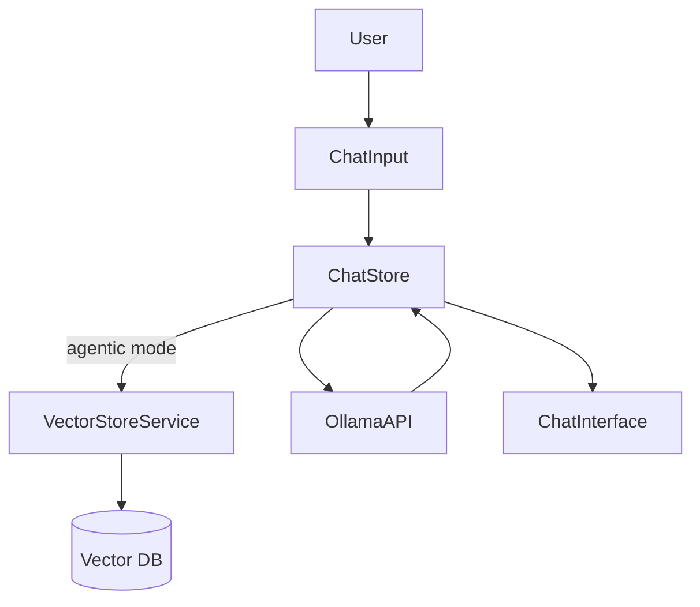

# Agentic Chat Mode

## Feature Purpose and Scope

Enable advanced conversation capabilities with context-aware responses. When activated, the chat retrieves relevant information from the local vector database before sending messages to Ollama.

## Core Flows and UI Touchpoints

- Mode selection via **ChatSettings** component.
- Messages handled in `useChatStore` with `mode` state.
- When in agentic mode, queries call `vectorStore.search` and prepend results to the conversation.
- Current mode is displayed as a badge in `ChatInterface`.

## Primary Types/Interfaces

- `Message` and `Conversation` from [`/types/chat`](../../types/chat).
- `ChatMessage` from [`/types/ollama`](../../types/ollama).
- `SearchResult` from [`/types/vector`](../../types/vector).

## Key Dependencies and Related Modules

- `VectorStoreService` in `src/lib/vector/store.ts`.
- Zustand stores `chat-store.ts` and `settings-store.ts`.
- UI components under `components/chat` and `components/ui`.

## Architecture Diagram

