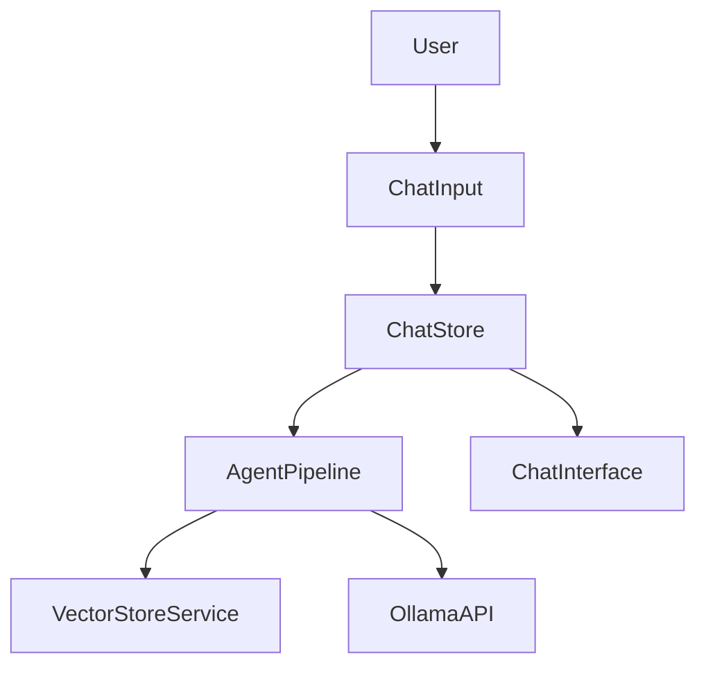

# Agentic Chat Mode

## Feature Purpose and Scope

Enable advanced conversation capabilities with context-aware responses. When activated, the chat routes messages through the LangChain agent pipeline to retrieve context and assemble prompts before calling Ollama.

## Core Flows and UI Touchpoints

- Mode selection via **ChatSettings** component.
- Messages handled in `useChatStore` with `mode` state.
- When in agentic mode, queries call `vectorStore.search` and prepend results to the conversation.
- Current mode is displayed as a badge in `ChatInterface`.
- Agent status updates (e.g. "retrieving documents") are shown below the conversation.
- A collapsible "Thinking" panel displays reasoning details from the pipeline.
- Token estimates are displayed after each request.
- Retrieved context documents are listed in a collapsible "Context Documents" section.
- Status messages show a spinner while streaming is active.

## Primary Types/Interfaces

- `Message` and `Conversation` from [`/types/chat`](../../types/chat).
- `ChatMessage` from [`/types/ollama`](../../types/ollama).
- `SearchResult` from [`/types/vector`](../../types/vector).

## Key Dependencies and Related Modules

- `VectorStoreService` in `src/lib/vector/store.ts`.
- `EmbeddingService` and `RerankerService` for improved search quality.
- Zustand stores `chat-store.ts` and `settings-store.ts`.
- UI components under `components/chat` and `components/ui`.

## Architecture Diagram

See [LangChain overview](../langchain/overview.md) for pipeline details.
