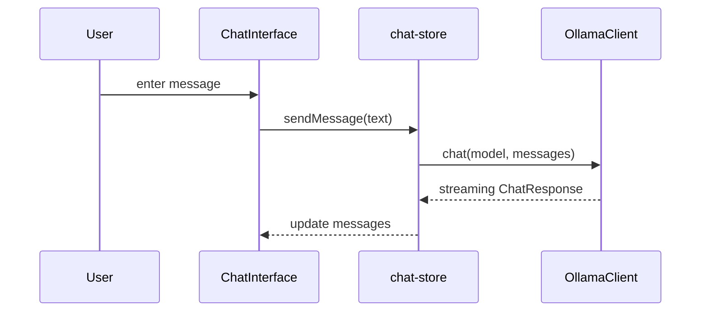

# Chat Interface

## Feature Purpose and Scope

Provide a simple interface for conversational interaction with a selected model using Ollama's streaming chat API. Messages are exchanged with a minimal UI suitable for early testing. The UI renders assistant responses using Markdown with syntax highlighting and safe sanitization.

## Core Flows and UI Touchpoints

- Users type messages in the `ChatInput` component.
- The `sendMessage` action in `chat-store` forwards the conversation to `OllamaClient.chat()`.
- Streaming responses are appended to the message list in real time.
- Messages are displayed with the `ChatMessage` component inside `ChatInterface`, which parses assistant responses as Markdown.

## Primary Types

- `ChatMessage` – individual chat entries
- `ChatRequest` and `ChatResponse` – structures for the API

Types are defined in [`/types/ollama`](../../types/ollama).

## Key Dependencies and Related Modules

- `OllamaClient` from `src/lib/ollama/client.ts`
- Zustand store in `stores/chat-store.ts`
- React components under `components/chat`
- `react-markdown` with `remark-gfm`, `rehype-highlight`, and `rehype-sanitize` for secure Markdown rendering

## Architecture Diagram

