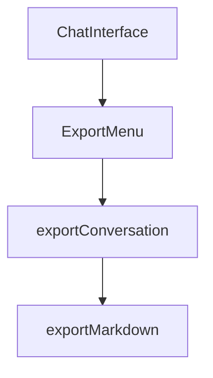

# Export Functionality

## Feature Purpose and Scope

Allow users to save chat conversations from the application. Conversations can be
exported in Markdown, PDF or JSON formats for sharing or archival.

## Core Flows and UI Touchpoints

- Export buttons available in the chat header via `ExportMenu`.
- Selected format triggers `exportConversation` which converts the message list.
- Downloaded file uses the chosen `ExportFormat`.

## Primary Types

- `ChatMessage` – conversation entry structure from [/types/ollama](../../types/ollama).
- `ExportFormat` – supported export options from [/types/markdown](../../types/markdown).

## Key Dependencies and Related Modules

- `exportConversation` utility in `src/lib/exportConversation.ts`.
- UI component `ExportMenu` under `components/chat`.
- `exportMarkdown` helper for Markdown/HTML/PDF downloads.

## Architecture Diagram

## Documentation Maintenance

Update this document if new export formats or flows are introduced.
