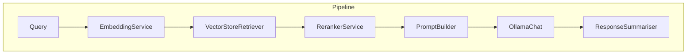

# LangChain Agent Pipeline

## Feature Purpose and Scope

Provide a modular pipeline for retrieval augmented generation (RAG) using LangChain. The pipeline handles embeddings, vector search, reranking and prompt assembly before streaming results from Ollama. Each step emits progress events so the UI can display the agent's current action. A separate "thinking" output exposes a short summary of the pipeline's reasoning which can be expanded in the chat UI. After the model responds, a lightweight summariser step generates a short overview for quick reference.

## Core Flows and UI Touchpoints

- Pipeline created in `useChatStore` with current `ChatSettings`.
- Messages and progress updates streamed from the pipeline directly into the chat UI.

## Primary Types/Interfaces

- Interfaces under [`/types/langchain`](../../types/langchain).
- `ChatSettings` from [`/types/settings`](../../types/settings).

## Key Dependencies and Related Modules

- `VectorStoreService` for document retrieval.
- `EmbeddingService` and `RerankerService` for search quality.
- LangChain `RunnableSequence` for composition.

## Architecture Diagram

