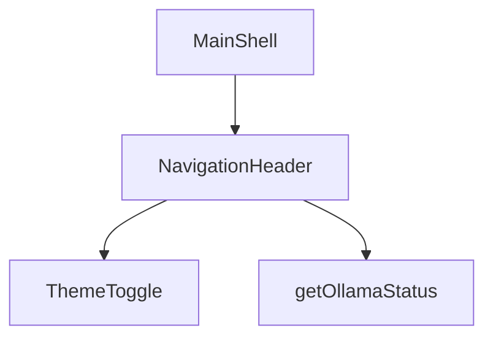

# Application Layout

## Feature purpose and scope

Provide a shared shell for all pages including a responsive navigation header and theme toggle.

## Core flows and UI touchpoints

- `NavigationHeader` displays links to Models, Chat and Settings.
- Connection status indicator pulsing green when connected, red when offline.
- Theme can be switched via `ThemeToggle`.

## Primary types/interfaces

- `OllamaStatus` – connection info from [`/types/ollama`](../../types/ollama).

## Key dependencies and related modules

- `ThemeProvider` and `ThemeToggle` from `components/ui`.
- `getOllamaStatus` in `src/lib/ollama/server.ts`.

