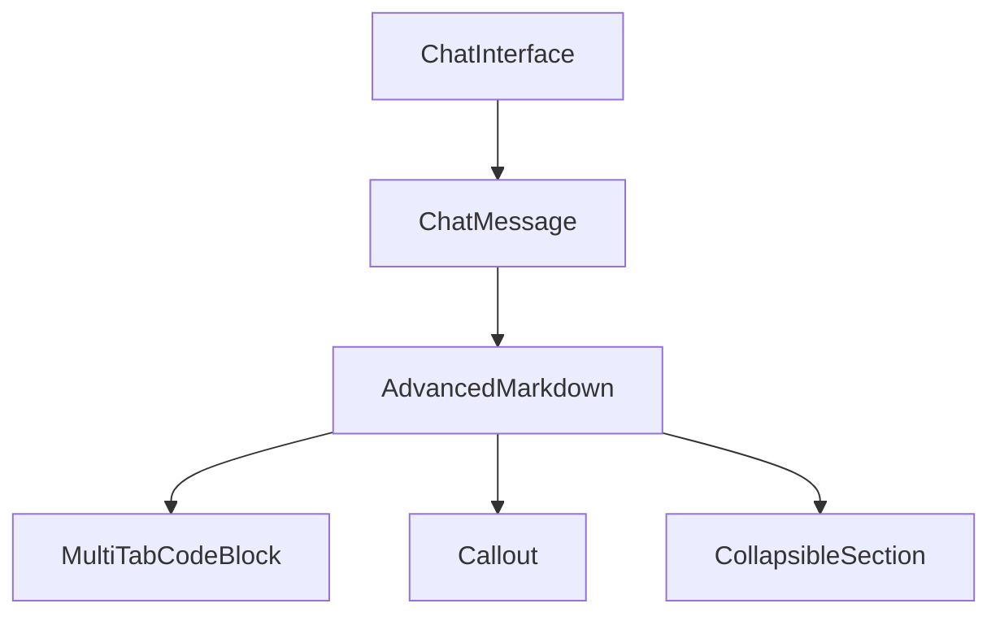

# Advanced Markdown Component

## Feature Purpose and Scope

Provide rich rendering of assistant responses including multi-file code blocks, callouts and collapsible sections. The component powers the chat interface and exposes utilities for searching and exporting code.

## Core Flows and UI Touchpoints

- Messages rendered with `AdvancedMarkdown` inside `ChatMessage`
- Code snippets displayed via `CodeBlock` or `MultiTabCodeBlock`
- Theme toggle available from `ThemeProvider`

## Primary Types

- `CodeBlock` – defines language, source and optional filename
- `ExportFormat` – supported export types

Types are defined in [`/types/markdown`](../../types/markdown).

## Key Dependencies and Related Modules

- `react-markdown` with `remark-gfm`, `remark-math`
- `rehype-highlight` and `rehype-sanitize` for secure output
- Components under `components/markdown`
- Theme utilities from `components/ui`

## Architecture Diagram

