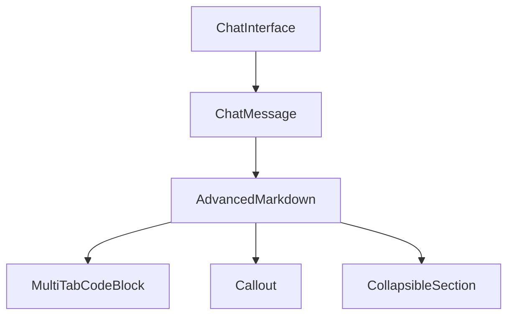

# Advanced Markdown Component

## Feature Purpose and Scope

Provide rich rendering of assistant responses including multi-file code blocks, callouts and collapsible sections. The component powers the chat interface and exposes utilities for searching and exporting code.

## Core Flows and UI Touchpoints

- Messages rendered with `AdvancedMarkdown` inside `ChatMessage`
- Code snippets displayed via `CodeBlock` or `MultiTabCodeBlock`
- Theme toggle available from `ThemeProvider`
- Code highlighting theme controlled via `CodeThemeProvider`
- Code blocks can be run inline for JavaScript and Python
- Snippets are editable via a Monaco editor with auto-save
- Export the full markdown as **PDF**, **HTML**, or **Markdown**
- Generate shareable links via the **Share** button

-## Primary Types

- `CodeBlock` – defines language, source, optional filename and line highlights
- `ExportFormat` – supported export types

Types are defined in [`/types/markdown`](../../types/markdown).

## Key Dependencies and Related Modules

- `react-markdown` with `remark-gfm`, `remark-math`, `remark-footnotes`
- `prismjs` with lazy language loading and `rehype-sanitize`
- `rehype-mermaid` for diagram rendering
- Components under `components/markdown`
- Theme utilities from `components/ui`
- Code theme controlled via `CodeThemeProvider`
- `SecurityLayer` utility powered by `DOMPurify` for additional XSS protection

## Architecture Diagram



## Usage Guidelines

Assistant responses should leverage these features whenever possible:

- Use **code tabs** when presenting multi-file or multi-language examples.
- Highlight important information with **callout blocks**.
- Wrap long explanations within **collapsible sections**.
- Reference sources with **footnotes**.[^1]
- Emphasize key lines in code using `{highlight: [n]}` metadata.

Example:

```markdown
Here is a note.[^note]

```ts {highlight: [2]}
function add(a: number, b: number) {
  return a + b;
}
```

[^note]: This footnote renders at the bottom of the message.

## Maintaining Documentation

Keep this documentation updated as new markdown capabilities are added in `components/markdown`.
