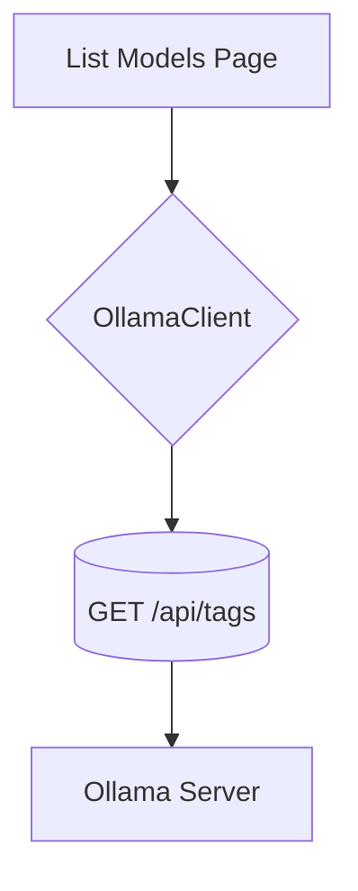

# Model Browser

## Feature Purpose and Scope

Provide a simple interface to view models available from the local Ollama instance. Users can browse model metadata and initiate a download.

## Core Flows and UI Touchpoints

- Fetch available models using `OllamaClient.listModels()`.
- Display models in a responsive grid of `ModelCard` components.
- Download action triggers `OllamaClient.pullModel()` (not yet implemented in UI).

## Primary Types

- `Model` – metadata for models

Types are defined in [`/types/ollama`](../../types/ollama).

## Key Dependencies and Related Modules

- `OllamaClient` from `src/lib/ollama/client.ts`
- React components under `components/models`

## Architecture Diagram

