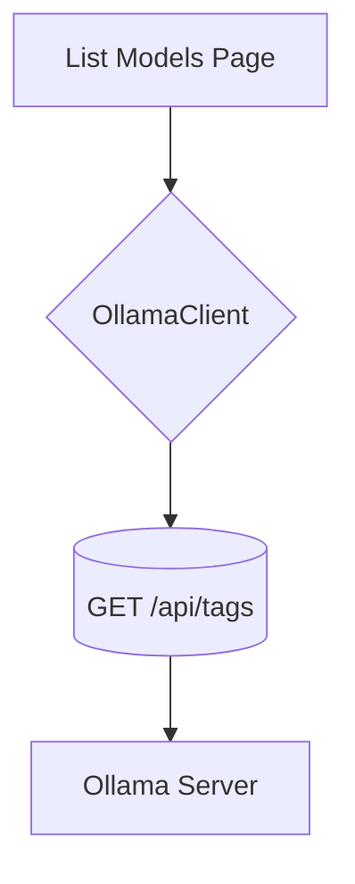

# Model Browser

## Feature Purpose and Scope

Provide a rich interface to browse and manage models available from the local Ollama instance. Users can search models, filter by capabilities and size, sort results and initiate a download.

## Core Flows and UI Touchpoints

- Fetch available models using `OllamaClient.listModels()`.
- Display models in a responsive grid of `ModelCard` components.
- Search input powered by **Fuse.js** for fuzzy matching.
- Category filters allow multi-select of `Model.capabilities` values.
- Size range slider filters models by download size.
- Sort options include Popular, Recent, Size and Performance.
- Download action triggers `OllamaClient.pullModel()` (not yet implemented in UI).

## Primary Types

- `Model` – metadata for models
- `ModelFilters` – parameters for filtering and sorting models

Types are defined in [`/types/ollama`](../../types/ollama).

## Key Dependencies and Related Modules

- `OllamaClient` from `src/lib/ollama/client.ts`
- React components under `components/models`

## Architecture Diagram

