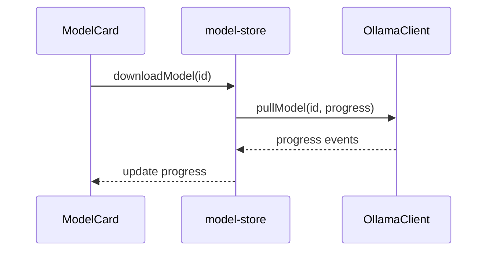

# Model Download Manager

## Feature Purpose and Scope

Handle fetching the list of available models from a local Ollama instance and manage download operations. Download progress is tracked in real time so UI components can display status.

## Core Flows and UI Touchpoints

- `fetchModels` retrieves available models via `OllamaClient.listModels()`.
- `downloadModel` initiates a download with `OllamaClient.pullModel()` and updates progress.
- Components like `ModelCard` subscribe to `useModelStore` to show progress and launch actions.

## Primary Types

- `Model` – metadata for models
- `PullProgress` – information about download progress

Types are defined in [`/types/ollama`](../../types/ollama).

## Key Dependencies and Related Modules

- `OllamaClient` in `src/lib/ollama/client.ts`
- Zustand store in `stores/model-store.ts`
- UI components under `components/models`

## Architecture Diagram

