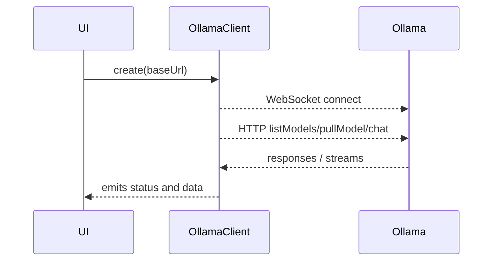

# Ollama Connection Service

## Feature Purpose and Scope

Establish and monitor communication with a local Ollama instance. The service
provides WebSocket connectivity, model listing, model download operations and a
streaming chat API. It forms the foundation for all further interactions with
Ollama.

## Core Flows and UI Touchpoints

- Create an `OllamaClient` with a base URL.
- Automatically reconnect on connection loss.
- Expose methods for model queries and chat streaming.
- Downstream features such as the model browser and chat UI rely on this service.

## Primary Types

- `OllamaConfig` – configuration for the client
- `OllamaStatus` – connection state information
- `PullProgress` – progress information for model downloads
- `ChatRequest` and `ChatResponse` – structures used for chatting
- `Model` – metadata for available models

These types are defined in [`/types/ollama`](../../types/ollama).

## Key Dependencies and Related Modules

- Browser `WebSocket` API for persistent connection
- Fetch API for HTTP requests
- EventEmitter from `events` to broadcast connection events

## Architecture Diagram

