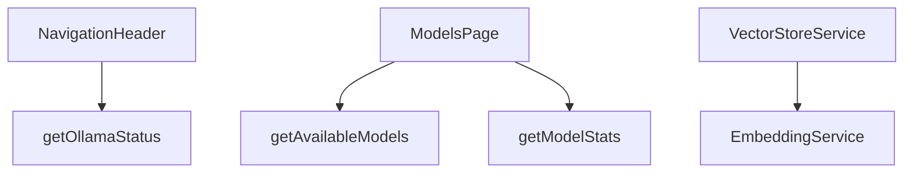
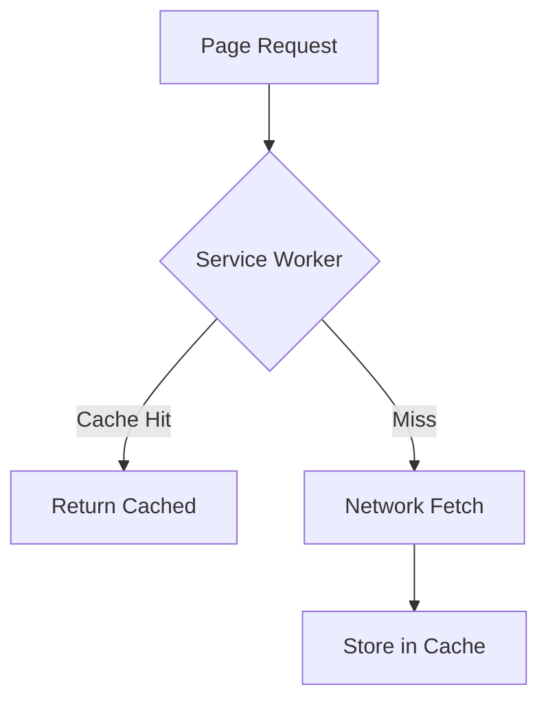

# Performance Optimizations

## Feature Purpose and Scope

Ensure the Ollama web interface remains responsive even with large models and long running agentic workflows. Optimizations span data fetching, caching and bundle size reduction.

## Core Flows and UI Touchpoints

- `NavigationHeader` component shows connection status using a streamed server component wrapped in `Suspense`.
- `ModelBrowser` dynamically imports heavy client logic.
- Service worker enables basic offline support.
- `VectorStoreService` caches embeddings and search results.

## Primary Types/Interfaces

- `ModelStats` – aggregate info about available models.

Types are defined in [`/types/ollama`](../../types/ollama).

## Key Dependencies and Related Modules

- Functions in `src/lib/ollama/server.ts` handle cached data fetching.
- Service worker code located in `/public/sw.js`.

Improve application responsiveness and load times using caching, dynamic imports and offline support.

## Core Flows and UI Touchpoints

- Model metadata fetched with `revalidate: 86400` caching.
- Service worker caches pages for offline access.
- Heavy components like `ModelBrowser` loaded dynamically.

## Primary Types/Interfaces

- `Model` from [/types/ollama](../../types/ollama).
- `SearchResult` from [/types/vector](../../types/vector).

## Key Dependencies and Related Modules

- `EmbeddingService` caching in `src/services/embedding-service.ts`.
- `VectorStoreService` result caching in `src/lib/vector/store.ts`.
- `ServiceWorkerProvider` component under `components/performance`.

## Architecture Diagram

## Documentation Maintenance

Update this document as new optimizations are added.
