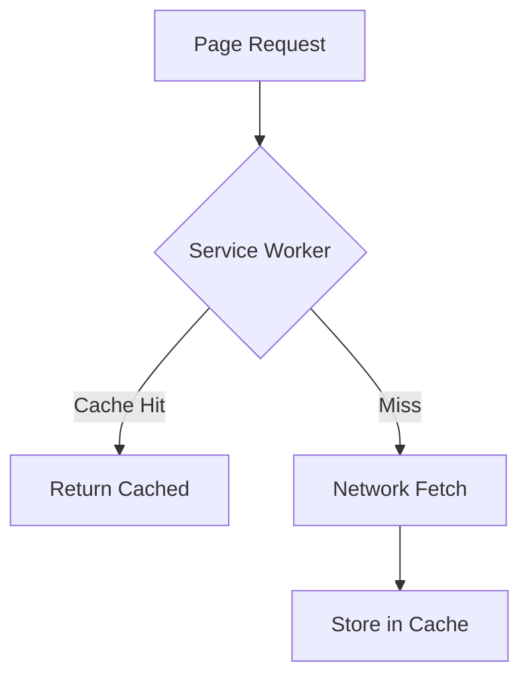

# Performance Optimizations

## Feature Purpose and Scope

Improve application responsiveness and load times using caching, dynamic imports and offline support.

## Core Flows and UI Touchpoints

- Model metadata fetched with `revalidate: 86400` caching.
- Service worker caches pages for offline access.
- Heavy components like `ModelBrowser` loaded dynamically.

## Primary Types/Interfaces

- `Model` from [/types/ollama](../../types/ollama).
- `SearchResult` from [/types/vector](../../types/vector).

## Key Dependencies and Related Modules

- `EmbeddingService` caching in `src/services/embedding-service.ts`.
- `VectorStoreService` result caching in `src/lib/vector/store.ts`.
- `ServiceWorkerProvider` component under `components/performance`.

## Architecture Diagram

## Documentation Maintenance

Update this document as new optimizations are added.
