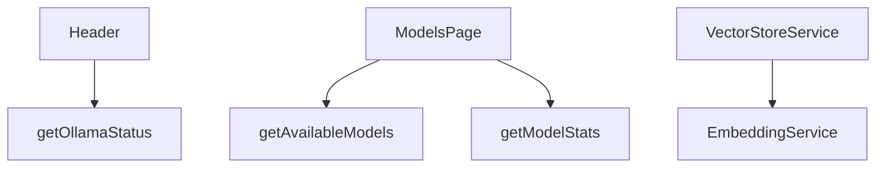

# Performance Optimizations

## Feature Purpose and Scope

Ensure the Ollama web interface remains responsive even with large models and long running agentic workflows. Optimizations span data fetching, caching and bundle size reduction.

## Core Flows and UI Touchpoints

- `Header` component shows connection status using a streamed server component wrapped in `Suspense`.
- `ModelBrowser` dynamically imports heavy client logic.
- Service worker enables basic offline support.
- `VectorStoreService` caches embeddings and search results.

## Primary Types/Interfaces

- `ModelStats` – aggregate info about available models.

Types are defined in [`/types/ollama`](../../types/ollama).

## Key Dependencies and Related Modules

- Functions in `src/lib/ollama/server.ts` handle cached data fetching.
- Service worker code located in `/public/sw.js`.

