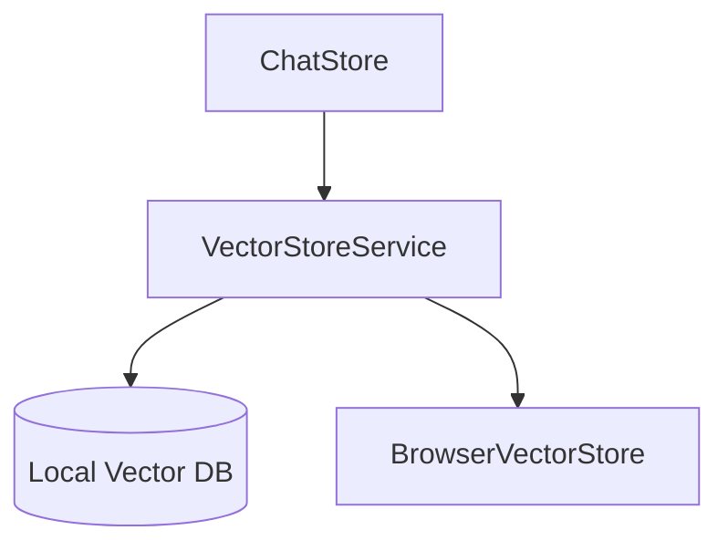

# Vector Database Integration

## Feature Purpose and Scope

Provide local storage and search of conversation context for agentic chat mode. The vector store runs entirely on the user's machine.

## Core Flows and UI Touchpoints

- Vector store initialized from `useSettingsStore` using a storage path.
- Conversations are added via `VectorStoreService.addConversation`.
- Queries from agentic features call `VectorStoreService.search`.

## Primary Types/Interfaces

- `Document` – data item to index.
- `SearchResult` – result entry with score and metadata.
- `SearchFilters` – optional filters for search queries.
- `VectorStoreOptions` – configuration for `VectorStoreService`.

Types are defined in [`/types/vector`](../../types/vector).

## Key Dependencies and Related Modules

- `chromadb` client used in `VectorStoreService`.
- `@lancedb/lancedb` for browser-based `BrowserVectorStore`.
- Settings state from `stores/settings-store.ts`.

## Architecture Diagram

