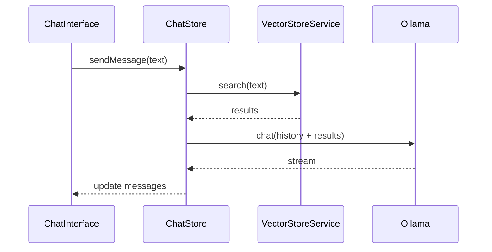
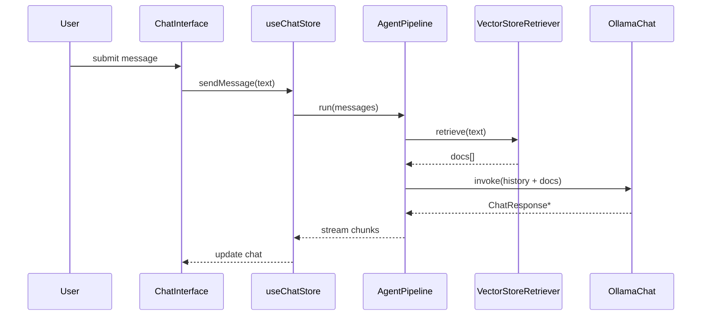

# LangChain Integration Plan

## Overview

This expanded document details the integration of [LangChain](https://python.langchain.com/docs/get_started/introduction) into the existing Ollama web application. The goal is to replace the minimal agentic flow with a robust and extensible pipeline capable of supporting complex retrieval, tool usage and future orchestration strategies.

The design strictly follows [`AGENTS.md`](AGENTS.md) and references the current architecture in [`docs/agentic-chat/overview.md`](docs/agentic-chat/overview.md) and [`docs/vector-store/overview.md`](docs/vector-store/overview.md).

## Design Goals

- **Modularity** – each concern (retrieval, prompt construction, LLM call, tool invocation) lives in its own module.
- **Extensibility** – the pipeline can easily accept new `Runnable` steps such as summarisation tools or external API calls.
- **Type Safety** – all LangChain-related types will reside under `/types/langchain` and be barrel exported via `/types/index.ts`.
- **Minimal UI Impact** – existing components remain intact, with `useChatStore` acting purely as an orchestrator.

## Current Agentic Flow

The current agentic mode retrieves context from a vector database and prepends it to the conversation before calling Ollama. It can be summarised as:



This implementation is functional but difficult to extend. There is no place to insert additional tools or prompts without modifying `chat-store.ts` directly.

## Proposed Architecture

LangChain will be introduced through a small set of wrapper classes and a streaming pipeline. The following high‑level diagram shows how the pieces fit together:

```mermaid
flowchart TD
    subgraph Stores
        D[ChatStore]
    end
    subgraph Services
        C[AgentPipeline]
    end
    subgraph LangChain
        A[OllamaChat\n(BaseChatModel)]
        B[VectorStoreRetriever\n(Retriever)]
    end
    D -- messages --> C
    C --> B
    B --> VectorStoreService
    C --> A
    A --> OllamaClient
```

### Key Modules

1. **OllamaChat** (`src/lib/langchain/ollama-chat.ts`)
   - Implements the LangChain `BaseChatModel` interface.
   - Wraps `OllamaClient.chat()` and yields `ChatResponse` chunks.
   - Respects settings from [`/types/ollama`](types/ollama).
2. **VectorStoreRetriever** (`src/lib/langchain/vector-retriever.ts`)
   - Implements LangChain's `Retriever` interface.
   - Uses `VectorStoreService.search()`.
   - Operates on `Document`, `SearchResult` and `SearchFilters` from [`/types/vector`](types/vector).
3. **AgentPipeline** (`src/services/agent-pipeline.ts`)
   - Factory function `createAgentPipeline(settings: ChatSettings)`.
   - Returns a `RunnableSequence` which:
     1. Retrieves documents using `VectorStoreRetriever`.
     2. Formats a prompt with conversation history (`Message` from [`/types/chat`](types/chat)).
     3. Streams completion chunks via `OllamaChat`.
   - Future tools can be inserted as additional `Runnable` steps without touching the store or UI.

### Data Flow



## New Types

All new types will be placed under `types/langchain` and barrel exported from `types/index.ts`.

```typescript
// types/langchain/AgentPipeline.ts
export interface AgentPipeline {
  run(messages: Message[]): AsyncGenerator<ChatResponse>;
}

// types/langchain/RetrieverOptions.ts
export interface RetrieverOptions {
  filters?: SearchFilters;
  topK?: number;
}
```

These interfaces formalise how the pipeline and retrievers operate, ensuring future tools follow consistent patterns.

## Step-by-Step Integration

1. **Dependency Setup**
   - `pnpm add langchain` within `ollama-ui`.
   - Update lockfile and commit.
2. **Scaffold Types**
   - Create `types/langchain` with `AgentPipeline.ts`, `RetrieverOptions.ts` and an `index.ts` barrel file.
   - Export from the root `types/index.ts`.
3. **LangChain Wrappers**
   - Implement `OllamaChat` and `VectorStoreRetriever` using the types defined above.
   - Ensure all methods return Promises or async generators.
4. **Agent Pipeline Service**
   - Build `createAgentPipeline(settings: ChatSettings)` returning an object matching `AgentPipeline`.
   - Compose a `RunnableSequence` with retrieval and LLM invocation.
   - Provide hooks to append additional `Runnable` steps.
5. **Store Refactor**
   - Update `useChatStore.sendMessage` to instantiate the pipeline and consume its stream.
   - Remove direct calls to `VectorStoreService` and `OllamaClient` from the store.
6. **Documentation**
   - Create `docs/langchain/overview.md` summarising the architecture, referencing this file and all related types.
   - Update diagrams in `docs/agentic-chat/overview.md` to include the new pipeline.
7. **Testing & Build**
   - Add unit tests for `OllamaChat` and `VectorStoreRetriever` under `ollama-ui`.
   - Run `pnpm test` and `pnpm build` to verify integration.

## Checklist Before Implementation

- [ ] Install LangChain and commit lockfile updates.
- [ ] Add `/types/langchain` with barrel exports.
- [ ] Implement `OllamaChat` wrapper.
- [ ] Implement `VectorStoreRetriever` wrapper.
- [ ] Create `AgentPipeline` service with insertion points for tools.
- [ ] Refactor `useChatStore` to use the pipeline.
- [ ] Update `docs/langchain/overview.md` and refresh diagrams across documentation.
- [ ] Ensure `pnpm build` and `pnpm test` succeed.

## Summary

By introducing LangChain as an orchestration layer, we separate retrieval, prompt construction and model invocation into clearly defined modules. The architecture allows new tools or advanced planning to be added without disrupting the UI or existing services. Following the above checklist will lead to a modular and easily extensible system that integrates smoothly with the current codebase.
