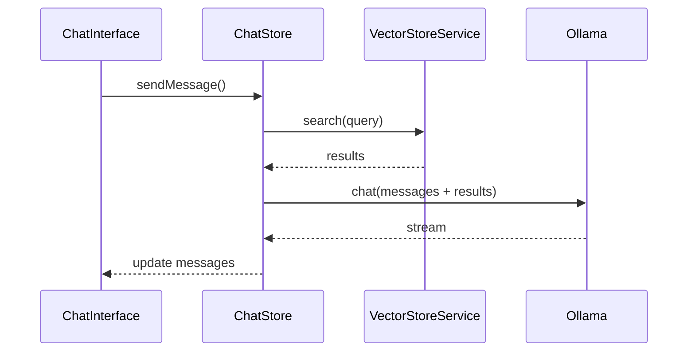
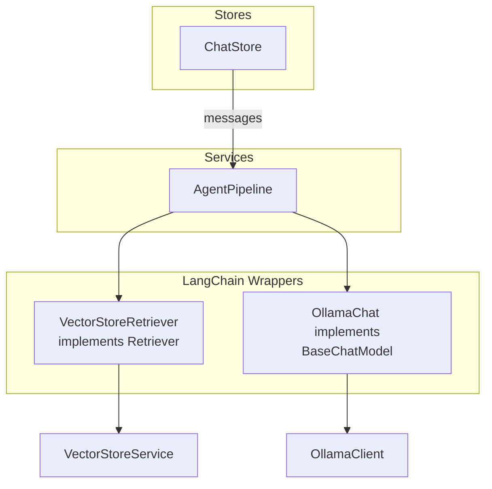
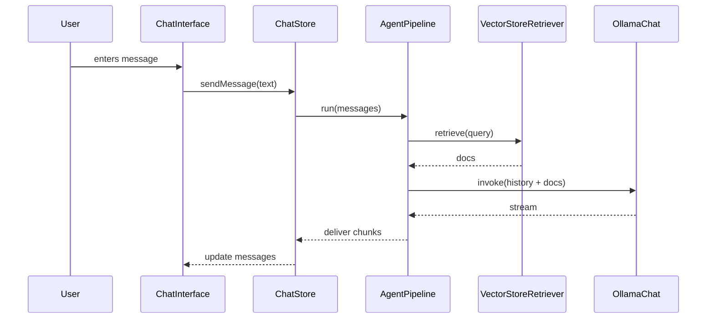

# LangChain Integration Plan

## Overview

This document outlines how to integrate [LangChain](https://python.langchain.com/docs/get_started/introduction) into the existing Ollama web application. The goal is to augment the current *agentic chat mode* with a robust, modular pipeline that can easily grow to support additional tools, enhanced retrieval and advanced orchestration.

The design described here follows the guidelines in [`AGENTS.md`](AGENTS.md) and builds on the existing architecture documented in [`docs/agentic-chat/overview.md`](docs/agentic-chat/overview.md) and [`docs/vector-store/overview.md`](docs/vector-store/overview.md).

## Current Agentic Flow

The application already supports a basic agentic mode:

- Mode selection is handled via the **ChatSettings** component and persisted in `useChatStore`.
- When the mode is set to `agentic`, `vectorStore.search` results are prepended to the user messages before calling the Ollama API.
- Retrieval uses `VectorStoreService`, which in turn operates on a browser‑side vector database (see [`BrowserVectorStore`](ollama-ui/src/lib/vector/browser-vector-store.ts)).

This flow is summarised in the following diagram extracted from the current documentation:

## Limitations

- Retrieval is a single step. There is no orchestration for summarisation, tool use or multi-turn planning.
- `VectorStoreService` is largely a stub, leaving the agentic mode minimal.
- Adding new behaviours requires custom wiring in `chat-store.ts`, making future extensions cumbersome.

## Why LangChain?

LangChain provides a lightweight framework for composing retrieval‑augmented generation, tool calling and agent-like behaviour. The current flow is linear, so we do not need the full LangGraph state machine. By wrapping our existing components with LangChain primitives we gain:

- Reusable building blocks (`RunnableSequence`, `Retriever`, `ChatModel`)
- Simple integration with streaming responses
- Clear entry points for future tools or custom prompts

## Proposed Architecture

We introduce a small set of modules under `src/lib/langchain` and one service in `src/services`. These wrap existing logic in a LangChain friendly way while preserving our existing types from [`/types`](types).

**Key Components**

- **OllamaChat** – wraps `OllamaClient.chat` as a LangChain `BaseChatModel`. It accepts `ChatRequest` parameters and yields `ChatResponse` chunks, reusing the types from [`/types/ollama`](types/ollama).
- **VectorStoreRetriever** – adapts `VectorStoreService.search` to LangChain's `Retriever` interface, operating on `Document` and `SearchResult` types from [`/types/vector`](types/vector).
- **AgentPipeline** – a `RunnableSequence` that performs:
  1. Retrieve context from the vector store.
  2. Format the prompt using conversation history (`Message` from [`/types/chat`](types/chat)).
  3. Invoke `OllamaChat` and stream results.

This arrangement keeps retrieval, prompt formatting and LLM invocation isolated so each part can be replaced or extended independently.

## Integration Steps

1. **Add LangChain dependencies**
   - Install `langchain` via pnpm in `ollama-ui`.
   - Ensure it is included in `package.json` and `pnpm-lock.yaml`.
2. **Implement `OllamaChat`**
   - Create `src/lib/langchain/ollama-chat.ts` that imports `OllamaClient` from `@/lib/ollama/client`.
   - Expose an async `invoke()` method returning an async generator of `ChatResponse`.
3. **Implement `VectorStoreRetriever`**
   - Create `src/lib/langchain/vector-retriever.ts`.
   - Use methods from `VectorStoreService` and types `SearchResult` and `SearchFilters`.
4. **Build the `AgentPipeline` service**
   - New file `src/services/agent-pipeline.ts` exports `createAgentPipeline(settings: ChatSettings)`.
   - Compose a `RunnableSequence` that performs retrieval then passes results to `OllamaChat`.
   - Allow injection of additional tools via LangChain `Runnable` interfaces.
5. **Refactor `useChatStore.sendMessage`**
   - Replace manual search and streaming loop with a call to `AgentPipeline`.
   - Messages remain stored as `Message` objects and displayed via `ChatMessage` component.
6. **Update Documentation**
   - Document the new architecture in `docs/agentic-chat/overview.md` with updated diagrams.
   - Reference the LangChain modules and how they map to existing types.
7. **Provide Extension Points**
   - Future tools (e.g. summarise, export or call external APIs) can be added by composing new `Runnable` steps before or after `OllamaChat`.

## High-Level Flow with LangChain

## Advantages of This Design

- **Modularity** – each piece (retrieval, formatting, LLM call) lives in its own module. Stores simply orchestrate.
- **Extensibility** – new tools can plug into the pipeline without touching UI code.
- **Testability** – each module can be unit tested in isolation. Existing tests around markdown rendering and security remain unaffected.
- **Type Safety** – the pipeline uses the central types defined under `/types`, ensuring consistent data across the app.

## Implementation Checklist

1. Add LangChain dependency and verify build.
2. Implement `OllamaChat` and `VectorStoreRetriever`.
3. Create `AgentPipeline` service and export a helper for streaming results.
4. Refactor `useChatStore` to use the pipeline.
5. Update relevant documentation and diagrams.
6. Run `pnpm build` and `pnpm test` to ensure the app compiles and tests pass.

Following this plan will let us gradually introduce LangChain while keeping the existing codebase stable. Each step is isolated and reversible, making the overall system more robust and easier to extend in future.
