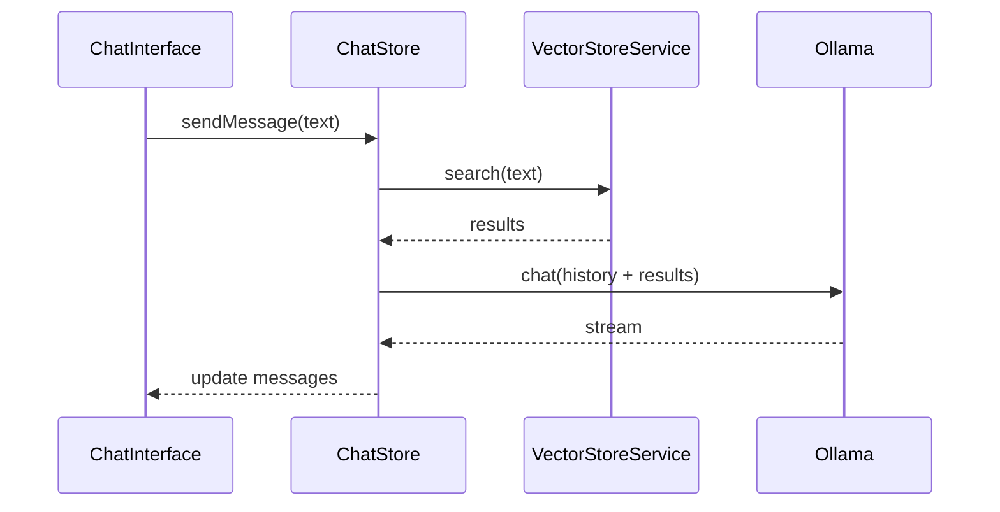
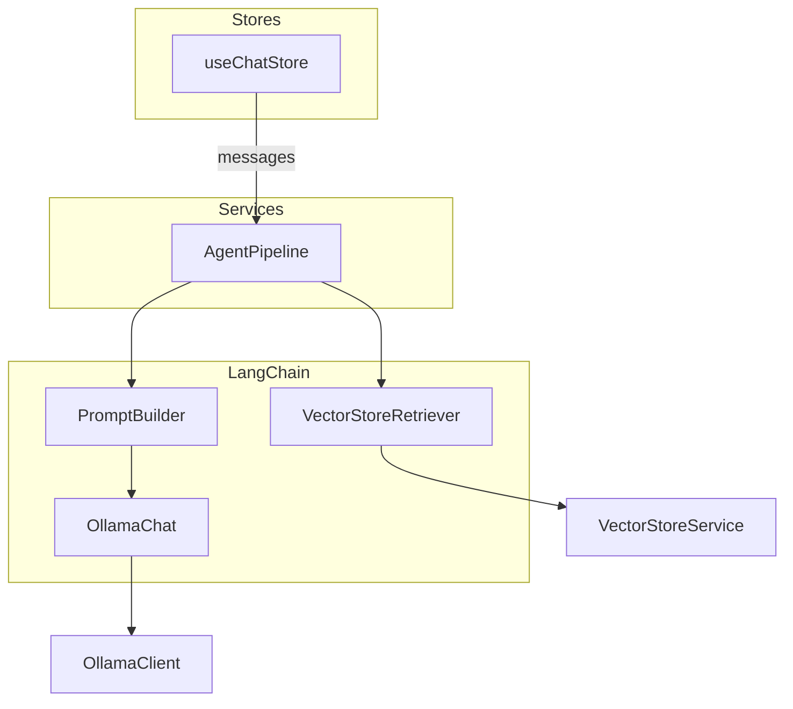
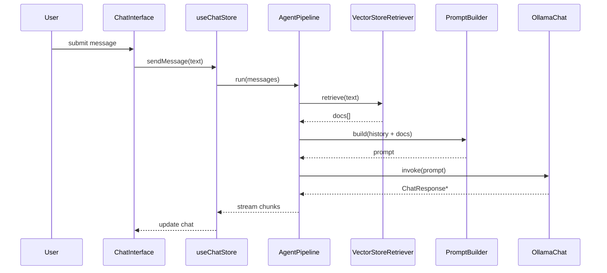

# LangChain Integration Plan

## Overview

This document expands on the initial integration notes and describes a full design for bringing [LangChain](https://python.langchain.com/docs/get_started/introduction) into the Ollama web application. The goal is to evolve the existing "agentic" chat mode into a modular pipeline that orchestrates retrieval, prompt assembly, LLM invocation and future tool usage. All design decisions must follow [AGENTS.md](AGENTS.md) and align with the documentation in `docs/`.

LangChain will provide the building blocks for a streaming agent pipeline without impacting the UI components. `useChatStore` remains the orchestrator of conversation state while LangChain handles each step of the workflow.

## Design Goals

- **Modularity** – each step (retrieval, prompt construction, LLM call, tool invocation) is isolated in its own module.
- **Extensibility** – new `Runnable` steps can be inserted without rewriting existing code. The pipeline exposes hooks for future tools such as summarisation or external APIs.
- **Type Safety** – all LangChain-related interfaces live under `/types/langchain` and are barrel exported via `/types/index.ts`.
- **Minimal UI Impact** – existing components remain unchanged; the store simply consumes an async generator from the pipeline.
- **Streaming** – responses stream through the pipeline so the UI updates in real time.

## Current Agentic Flow

The present implementation fetches context from the vector store and prepends it to the conversation before sending the request to Ollama.



While functional, this flow does not allow additional tools or processing steps without directly modifying `chat-store.ts`.

## Target Architecture

LangChain introduces a streaming pipeline that composes small `Runnable` units. Each unit focuses on a single responsibility and can be replaced or reordered. The high-level architecture is shown below.



### Pipeline Steps

1. **VectorStoreRetriever** – fetches relevant documents.
2. **PromptBuilder** – assembles conversation history and retrieved documents into the final prompt.
3. **OllamaChat** – streams completion chunks from the Ollama API.
4. **Tool Steps (optional)** – custom tools can be inserted anywhere in the pipeline via LangChain's `RunnableSequence`.

### Sequence with Optional Tools



## Module Breakdown

| Module | Path | Responsibility |
| ------ | ---- | -------------- |
| `OllamaChat` | `src/lib/langchain/ollama-chat.ts` | Implements `BaseChatModel` and wraps `OllamaClient.chat` for streaming. |
| `VectorStoreRetriever` | `src/lib/langchain/vector-retriever.ts` | Adapter implementing LangChain's `Retriever` interface using `VectorStoreService`. |
| `PromptBuilder` | `src/lib/langchain/prompt-builder.ts` | Constructs prompts from chat history, retrieved docs and `ChatSettings`. |
| `AgentPipeline` | `src/services/agent-pipeline.ts` | Factory producing a `RunnableSequence` composed of the above steps plus optional tools. |

Additional tools can live under `src/lib/langchain/tools/` and be composed into the pipeline without altering the store.

## Type Definitions

All types reside under `types/langchain`:

```typescript
// types/langchain/AgentPipeline.ts
export interface AgentPipeline {
  run(messages: Message[]): AsyncGenerator<ChatResponse>;
}

// types/langchain/RetrieverOptions.ts
export interface RetrieverOptions {
  filters?: SearchFilters;
  topK?: number;
}

// types/langchain/PromptOptions.ts
export interface PromptOptions {
  systemPrompt?: string;
}

// types/langchain/Tool.ts
export interface Tool {
  name: string;
  invoke(input: string): Promise<string>;
}
```

These interfaces ensure a consistent contract for pipeline steps and future tools.

## Extending the Pipeline

The `createAgentPipeline` factory exposes a simple API for adding new `Runnable` steps:

```typescript
const pipeline = createAgentPipeline(settings)
  .use(new VectorStoreRetriever(opts))
  .use(new PromptBuilder())
  .use(myCustomTool)
  .use(new OllamaChat(settings));
```

Each call to `.use()` returns a new sequence with the additional step. The resulting pipeline yields `ChatResponse` chunks that the store forwards to the UI. Tools can transform the input or output of any step, making the system easy to extend.

## Implementation Steps

1. **Install Dependencies**
   - Run `pnpm add langchain` inside `ollama-ui`.
   - Commit the updated lockfile.
2. **Add Type Definitions**
   - Create `/types/langchain` with the interfaces shown above and an `index.ts` barrel file.
   - Re-export these types from the root `types/index.ts`.
3. **Create LangChain Wrappers**
   - Implement `OllamaChat` to conform to `BaseChatModel` and stream `ChatResponse` chunks.
   - Implement `VectorStoreRetriever` using `VectorStoreService.search`.
   - Implement `PromptBuilder` for assembling prompts.
4. **Build AgentPipeline Service**
   - `createAgentPipeline(settings: ChatSettings)` returns an object implementing `AgentPipeline`.
   - Compose steps using LangChain's `RunnableSequence`.
   - Provide a `.use(step: Runnable)` method for inserting tools.
5. **Refactor useChatStore**
   - Replace the existing agentic logic with a call to `pipeline.run(messages)`.
   - Stream chunks into the message list as they arrive.
6. **Documentation Updates**
   - Add `docs/langchain/overview.md` summarising this architecture with diagrams.
   - Update `docs/agentic-chat/overview.md` to reference the new pipeline design.
7. **Testing**
   - Create unit tests for each wrapper and the pipeline builder.
   - Ensure vector search and streaming behaviour work as expected.
8. **Build Verification**
   - Run `pnpm test` and `pnpm build` before merging any code changes.

## Checklist

- [ ] Install LangChain dependency.
- [ ] Add `/types/langchain` with `AgentPipeline`, `RetrieverOptions`, `PromptOptions` and `Tool` definitions.
- [ ] Implement `OllamaChat` wrapper with streaming support.
- [ ] Implement `VectorStoreRetriever` wrapper.
- [ ] Implement `PromptBuilder`.
- [ ] Create `AgentPipeline` service exposing `.use()` for additional tools.
- [ ] Refactor `useChatStore` to consume the pipeline.
- [ ] Document the architecture under `docs/langchain` and update existing diagrams.
- [ ] Add unit tests for new modules.
- [ ] Verify with `pnpm test` and `pnpm build`.

## Summary

This plan introduces LangChain as a flexible orchestration layer while keeping the UI untouched. By isolating retrieval, prompt generation and LLM calls into independent steps we gain a clear extension point for future tools. The provided types and modular pipeline ensure that additional capabilities can be integrated with minimal friction.
