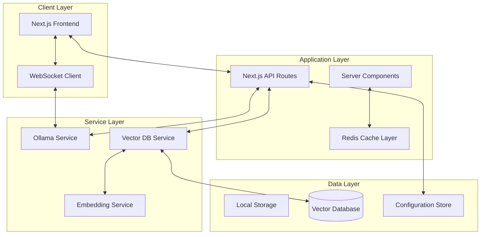

# Ollama Web Interface - Architectural Design Documentation

## Executive Summary

This document outlines the architectural design and implementation strategy for a modern web interface for Ollama, built with Next.js 15, Tailwind CSS 4.1, and shadcn/ui components. The application provides an intuitive, high-performance interface for managing and interacting with local language models, featuring both simple and advanced conversational modes with vector database integration.

## Table of Contents

1. [Project Overview](#project-overview)
2. [Technology Stack](#technology-stack)
3. [System Architecture](#system-architecture)
4. [Core Features](#core-features)
5. [Technical Implementation](#technical-implementation)
6. [Component Architecture](#component-architecture)
7. [Data Flow & State Management](#data-flow--state-management)
8. [Security & Performance](#security--performance)
9. [Development Roadmap](#development-roadmap)
10. [Deployment Strategy](#deployment-strategy)

## Project Overview

### Vision

Create a professional-grade web application that democratizes access to Ollama's capabilities, enabling non-technical users to harness the power of local language models through an elegant, responsive interface that rivals commercial offerings like ChatGPT and Claude.

### Key Objectives

- **Accessibility**: Enable non-developers to utilize Ollama's full potential
- **Performance**: Leverage Next.js 15's latest optimizations for sub-second load times
- **Extensibility**: Build a modular architecture supporting future AI capabilities
- **User Experience**: Deliver a premium interface with thoughtful animations and interactions

### Target Users

- AI enthusiasts without technical backgrounds
- Developers seeking a polished UI for Ollama
- Organizations requiring private, local AI solutions
- Educational institutions teaching AI concepts

## Technology Stack

### Core Framework

```
Next.js 15.x (App Router)
├── React 19 with Server Components
├── TypeScript 5.4+
└── Turbopack for development
```

### Styling & UI

```
Tailwind CSS 4.1
├── CSS-first configuration
├── Modern CSS features (cascade layers, @property)
└── Zero configuration approach

shadcn/ui (latest)
├── Radix UI primitives
├── Fully accessible components
└── New York style theme
```

### Data Management

```
State Management
├── Zustand for global state
├── TanStack Query for server state
└── React Hook Form for forms

Vector Database (Agentic Mode)
├── ChromaDB or LanceDB (embedded)
├── FAISS for similarity search
└── Local persistence layer
```

### AI Integration

```
Ollama Integration
├── Native HTTP API client
├── WebSocket for streaming
├── Model management SDK
└── Embedding/reranking pipelines
```

### Development Tools

```
Build & Development
├── Vite plugin for Tailwind 4.1
├── ESLint 9 with flat config
├── Prettier 3.x
├── Husky for git hooks
└── Commitizen for conventional commits
```

## System Architecture

### High-Level Architecture



### Component Hierarchy

```
src/
├── app/                          # Next.js 15 App Router
│   ├── (auth)/                   # Authentication group
│   ├── (dashboard)/              # Main application
│   │   ├── models/               # Model management
│   │   ├── chat/                 # Chat interface
│   │   └── settings/             # User settings
│   ├── api/                      # API routes
│   │   ├── ollama/              # Ollama proxy
│   │   ├── embeddings/          # Embedding endpoints
│   │   └── health/              # Health checks
│   └── layout.tsx               # Root layout
│
├── components/                   # Shared components
│   ├── ui/                      # shadcn/ui components
│   ├── models/                  # Model-specific components
│   ├── chat/                    # Chat components
│   └── common/                  # Common components
│
├── lib/                         # Core utilities
│   ├── ollama/                  # Ollama client
│   ├── vector/                  # Vector DB client
│   ├── hooks/                   # Custom hooks
│   └── utils/                   # Utility functions
│
├── services/                    # Business logic
│   ├── model-service.ts         # Model management
│   ├── chat-service.ts          # Chat logic
│   └── embedding-service.ts     # Embedding logic
│
└── stores/                      # State management
    ├── chat-store.ts            # Chat state
    ├── model-store.ts           # Model state
    └── settings-store.ts        # Settings state
```

## Core Features

### 1. Ollama Connection Monitor

#### Visual Design

- **Status Indicator**: Animated breathing dot in navigation bar
  - Green: Connected and responsive
  - Yellow: Connecting or slow response
  - Red: Disconnected or error state
- **Tooltip Information**: Hover reveals connection details
  - Ollama version
  - Response time
  - Available models count

#### Technical Implementation

```typescript
interface OllamaStatus {
  connected: boolean;
  version: string;
  latency: number;
  modelCount: number;
  lastChecked: Date;
}

// Polling mechanism with exponential backoff
const useOllamaConnection = () => {
  // WebSocket for real-time updates
  // HTTP fallback for compatibility
  // Automatic reconnection logic
};
```

### 2. Model Management Interface

#### Browse Models Tab

- **Card Grid Layout**: Responsive masonry grid
- **Model Cards**:
  - Hero image or generated gradient
  - Model name and size
  - Performance metrics (tokens/sec)
  - Category badges (Vision, Code, Chat, etc.)
  - Quick actions (Download, Info, Try)
- **Search & Filter**:
  - Full-text search with Fuse.js
  - Multi-select category filters
  - Size range slider
  - Sort options (Popular, Recent, Size, Performance)

#### Downloaded Models Tab

- **Enhanced Cards**:
  - Usage statistics
  - Last used timestamp
  - Quick launch to chat
  - Update available indicator
- **Bulk Operations**:
  - Select multiple for deletion
  - Export/import model collections
  - Batch updates

#### Model Detail Dialog

```typescript
interface ModelDetail {
  id: string;
  name: string;
  description: string;
  size: string;
  quantization: string;
  context_length: number;
  embedding_dimension?: number;
  capabilities: ModelCapability[];
  benchmarks: Benchmark[];
  systemRequirements: SystemReq;
  examples: UsageExample[];
}
```

### 3. Chat Interface

#### Simple Mode

- **Clean Interface**: Focus on conversation
- **Features**:
  - Markdown rendering with syntax highlighting
  - Code blocks with copy functionality
  - Image upload and analysis (for vision models)
  - Voice input/output integration
  - Export conversations (MD, PDF, JSON)

#### Agentic Mode

- **Enhanced Capabilities**:
  - Context-aware responses using vector search
  - Document upload and indexing
  - Multi-turn reasoning with memory
  - Tool use (web search, calculations, file operations)
  - Conversation branching and versioning

#### UI Components

```typescript
// Message component with animations
const ChatMessage = ({
  message,
  isStreaming,
  onEdit,
  onBranch,
  onRegenerate,
}) => {
  // Smooth streaming text animation
  // Action buttons on hover
  // Markdown processing
  // Copy/edit functionality
};

// Input component with advanced features
const ChatInput = ({ onSubmit, onVoiceInput, onFileUpload, suggestions }) => {
  // Auto-resize textarea
  // Paste image handling
  // Command palette (/commands)
  // Token counter
};
```

### 4. Vector Database Integration

#### Architecture

```typescript
interface VectorStore {
  initialize(path: string): Promise<void>;
  addDocument(doc: Document): Promise<string>;
  search(query: string, k: number): Promise<SearchResult[]>;
  updateEmbeddings(modelId: string): Promise<void>;
}

class LocalVectorStore implements VectorStore {
  private db: ChromaClient | LanceDB;
  private embedder: EmbeddingModel;

  // Automatic chunking strategies
  // Hybrid search (dense + sparse)
  // Metadata filtering
  // Incremental indexing
}
```

#### User Flow

1. First-time setup wizard
2. Storage location selection
3. Automatic model downloads (embedding/reranking)
4. Progress indicators with time estimates
5. Background indexing of conversations

## Technical Implementation

### Project Setup

#### 1. Initialize Next.js 15 Project

```bash
npx create-next-app@latest ollama-ui --typescript --eslint --app

# Navigate to project
cd ollama-ui

# Install Tailwind CSS 4.1
npm install tailwindcss @tailwindcss/postcss postcss

# Create postcss.config.mjs
echo 'export default { plugins: { "@tailwindcss/postcss": {} } }' > postcss.config.mjs
```

#### 2. Configure Tailwind CSS 4.1

```css
/* app/globals.css */
@import "tailwindcss";

@theme {
  --font-sans: "Inter", "system-ui", "sans-serif";
  --font-mono: "JetBrains Mono", "monospace";

  /* Custom design tokens */
  --color-ollama-green: oklch(0.7 0.2 145);
  --color-ollama-dark: oklch(0.15 0.02 260);

  /* Animation curves */
  --ease-bounce: cubic-bezier(0.68, -0.55, 0.265, 1.55);
  --ease-smooth: cubic-bezier(0.4, 0, 0.2, 1);

  /* Spacing scale */
  --spacing-xs: 0.5rem;
  --spacing-sm: 1rem;
  --spacing-md: 1.5rem;
  --spacing-lg: 2rem;
  --spacing-xl: 3rem;
}

/* Custom utilities */
@utility breathing-dot {
  @keyframes breathe {
    0%,
    100% {
      opacity: 1;
      transform: scale(1);
    }
    50% {
      opacity: 0.6;
      transform: scale(0.95);
    }
  }
  animation: breathe 2s ease-in-out infinite;
}

@utility glass-morphism {
  backdrop-filter: blur(10px);
  background: rgba(255, 255, 255, 0.1);
  border: 1px solid rgba(255, 255, 255, 0.2);
}
```

#### 3. Setup shadcn/ui

```bash
# Initialize shadcn/ui with Next.js 15 support
npx shadcn@latest init -d

# Select options:
# ✓ New York style
# ✓ Slate color
# ✓ CSS variables

# Install essential components
npx shadcn@latest add button card dialog input select tabs toast
npx shadcn@latest add command dropdown-menu scroll-area sheet
npx shadcn@latest add tooltip avatar badge skeleton alert
```

#### 4. Install Additional Dependencies

```bash
# Core dependencies
npm install zustand @tanstack/react-query axios
npm install react-hook-form @hookform/resolvers zod
npm install framer-motion lucide-react

# Chat dependencies
npm install react-markdown remark-gfm rehype-highlight
npm install @uiw/react-md-editor katex

# Vector DB dependencies
npm install chromadb @lancedb/lancedb
npm install openai tiktoken

# Development dependencies
npm install -D @types/node @types/react @types/react-dom
npm install -D eslint-config-next prettier
npm install -D @commitlint/cli @commitlint/config-conventional husky
```

### Core Services Implementation

#### Ollama Service

```typescript
// lib/ollama/client.ts
import { EventEmitter } from "events";

interface OllamaConfig {
  baseUrl: string;
  timeout?: number;
  retryAttempts?: number;
}

export class OllamaClient extends EventEmitter {
  private ws: WebSocket | null = null;
  private reconnectTimer: NodeJS.Timeout | null = null;

  constructor(private config: OllamaConfig) {
    super();
    this.connect();
  }

  private connect(): void {
    try {
      this.ws = new WebSocket(`${this.config.baseUrl}/ws`);
      this.setupEventHandlers();
    } catch (error) {
      this.handleConnectionError(error);
    }
  }

  async listModels(): Promise<Model[]> {
    const response = await fetch(`${this.config.baseUrl}/api/tags`);
    return response.json();
  }

  async pullModel(
    name: string,
    onProgress?: (progress: PullProgress) => void
  ): Promise<void> {
    // Implementation with streaming progress
  }

  async chat(request: ChatRequest): AsyncGenerator<ChatResponse> {
    // Streaming chat implementation
  }
}
```

#### Vector Store Service

```typescript
// lib/vector/store.ts
import { ChromaClient } from "chromadb";
import { Document, Embedding } from "@/types";

export class VectorStoreService {
  private client: ChromaClient;
  private collection: Collection;

  async initialize(options: VectorStoreOptions): Promise<void> {
    this.client = new ChromaClient({
      path: options.storagePath,
      // Use local persistent storage
    });

    this.collection = await this.client.getOrCreateCollection({
      name: "ollama_chat_context",
      metadata: {
        "hnsw:space": "cosine",
        "hnsw:construction_ef": 200,
        "hnsw:M": 16,
      },
    });
  }

  async addConversation(
    conversationId: string,
    messages: Message[]
  ): Promise<void> {
    const chunks = await this.chunkMessages(messages);
    const embeddings = await this.generateEmbeddings(chunks);

    await this.collection.add({
      ids: chunks.map((c) => c.id),
      embeddings: embeddings,
      metadatas: chunks.map((c) => c.metadata),
      documents: chunks.map((c) => c.text),
    });
  }

  async search(
    query: string,
    filters?: SearchFilters
  ): Promise<SearchResult[]> {
    const queryEmbedding = await this.generateEmbedding(query);

    const results = await this.collection.query({
      queryEmbeddings: [queryEmbedding],
      nResults: filters?.topK || 5,
      where: filters?.metadata,
    });

    return this.processResults(results);
  }
}
```

### Component Architecture

#### Model Card Component

```typescript
// components/models/ModelCard.tsx
"use client";

import { motion } from "framer-motion";
import { Download, Info, Play, Clock, Cpu } from "lucide-react";
import { Card } from "@/components/ui/card";
import { Badge } from "@/components/ui/badge";
import { Button } from "@/components/ui/button";
import { useModelStore } from "@/stores/model-store";

interface ModelCardProps {
  model: Model;
  onSelect: (model: Model) => void;
  isDownloaded?: boolean;
}

export const ModelCard = ({
  model,
  onSelect,
  isDownloaded,
}: ModelCardProps) => {
  const { downloadModel, downloadProgress } = useModelStore();

  return (
    <motion.div
      initial={{ opacity: 0, y: 20 }}
      animate={{ opacity: 1, y: 0 }}
      transition={{ duration: 0.3 }}
      whileHover={{ y: -4 }}
      className="group"
    >
      <Card
        className="overflow-hidden glass-morphism border-white/10 
                       hover:border-white/20 transition-all duration-300"
      >
        {/* Gradient background based on model capabilities */}
        <div className="h-32 relative overflow-hidden">
          <div
            className={`absolute inset-0 bg-gradient-to-br 
                          ${getModelGradient(model.capabilities)}`}
          />
          <div className="absolute inset-0 bg-black/20" />

          {/* Floating badges */}
          <div className="absolute top-2 right-2 flex gap-1">
            {model.capabilities.map((cap) => (
              <Badge key={cap} variant="secondary" className="text-xs">
                {cap}
              </Badge>
            ))}
          </div>
        </div>

        <div className="p-4 space-y-3">
          <div>
            <h3 className="font-semibold text-lg">{model.name}</h3>
            <p className="text-sm text-muted-foreground line-clamp-2">
              {model.description}
            </p>
          </div>

          {/* Stats */}
          <div className="flex items-center gap-4 text-sm text-muted-foreground">
            <span className="flex items-center gap-1">
              <Cpu className="w-3 h-3" />
              {model.size}
            </span>
            <span className="flex items-center gap-1">
              <Clock className="w-3 h-3" />
              {model.performance}
            </span>
          </div>

          {/* Actions */}
          <div className="flex gap-2">
            {isDownloaded ? (
              <Button className="flex-1" onClick={() => onSelect(model)}>
                <Play className="w-4 h-4 mr-1" />
                Launch
              </Button>
            ) : (
              <Button
                className="flex-1"
                onClick={() => downloadModel(model.id)}
                disabled={downloadProgress[model.id] !== undefined}
              >
                {downloadProgress[model.id] ? (
                  <span>{Math.round(downloadProgress[model.id])}%</span>
                ) : (
                  <>
                    <Download className="w-4 h-4 mr-1" />
                    Download
                  </>
                )}
              </Button>
            )}
            <Button
              variant="outline"
              size="icon"
              onClick={() => {
                /* Show details */
              }}
            >
              <Info className="w-4 h-4" />
            </Button>
          </div>
        </div>
      </Card>
    </motion.div>
  );
};
```

#### Chat Interface Component

```typescript
// components/chat/ChatInterface.tsx
"use client";

import { useState, useRef, useEffect } from "react";
import { motion, AnimatePresence } from "framer-motion";
import { useChatStore } from "@/stores/chat-store";
import { ChatMessage } from "./ChatMessage";
import { ChatInput } from "./ChatInput";
import { ModelSelector } from "./ModelSelector";
import { ChatSettings } from "./ChatSettings";

export const ChatInterface = () => {
  const { messages, isStreaming, sendMessage, currentModel, mode } =
    useChatStore();

  const messagesEndRef = useRef<HTMLDivElement>(null);

  // Auto-scroll to bottom
  useEffect(() => {
    messagesEndRef.current?.scrollIntoView({
      behavior: "smooth",
      block: "end",
    });
  }, [messages]);

  return (
    <div className="flex flex-col h-screen bg-background">
      {/* Header */}
      <header className="border-b px-4 py-3 flex items-center justify-between">
        <div className="flex items-center gap-4">
          <ModelSelector />
          <Badge variant={mode === "agentic" ? "default" : "outline"}>
            {mode} mode
          </Badge>
        </div>
        <ChatSettings />
      </header>

      {/* Messages */}
      <div className="flex-1 overflow-y-auto">
        <AnimatePresence mode="popLayout">
          {messages.map((message, index) => (
            <motion.div
              key={message.id}
              initial={{ opacity: 0, y: 10 }}
              animate={{ opacity: 1, y: 0 }}
              exit={{ opacity: 0, scale: 0.95 }}
              transition={{
                duration: 0.2,
                delay: index * 0.05,
              }}
            >
              <ChatMessage
                message={message}
                isStreaming={isStreaming && index === messages.length - 1}
              />
            </motion.div>
          ))}
        </AnimatePresence>
        <div ref={messagesEndRef} />
      </div>

      {/* Input */}
      <ChatInput onSend={sendMessage} />
    </div>
  );
};
```

## Data Flow & State Management

### State Architecture

```typescript
// stores/index.ts
interface AppState {
  // Connection state
  ollama: {
    status: OllamaStatus;
    availableModels: Model[];
    downloadedModels: Model[];
  };

  // Chat state
  chat: {
    conversations: Conversation[];
    activeConversation: string | null;
    messages: Message[];
    isStreaming: boolean;
    mode: "simple" | "agentic";
  };

  // Settings state
  settings: {
    theme: "light" | "dark" | "system";
    vectorStorePath: string | null;
    embeddingModel: string | null;
    rerankingModel: string | null;
    chatSettings: ChatSettings;
  };
}
```

### Data Flow Patterns

1. **Model Download Flow**

   ```
   User clicks download →
   Zustand action dispatched →
   Ollama API call initiated →
   Progress events streamed →
   UI updates in real-time →
   Model cached locally
   ```

2. **Chat Message Flow**

   ```
   User sends message →
   Optimistic UI update →
   Vector search (if agentic) →
   Context assembly →
   Stream to Ollama →
   Token-by-token response →
   Update conversation history
   ```

3. **Vector Indexing Flow**
   ```
   Conversation completed →
   Background indexing job →
   Chunk messages →
   Generate embeddings →
   Store in vector DB →
   Update search index
   ```

## Security & Performance

### Security Considerations

1. **Local-First Architecture**

   - All data stored locally
   - No external API calls (except Ollama)
   - Encrypted vector database option
   - Secure WebSocket connections

2. **Input Validation**

   - Zod schemas for all user inputs
   - File upload restrictions
   - XSS prevention in markdown rendering
   - CSRF protection for API routes

3. **Privacy Features**
   - Conversation export with PII removal
   - Automatic cleanup policies
   - Incognito chat mode
   - Model isolation

### Performance Optimizations

1. **Next.js 15 Optimizations**

   ```typescript
   // Parallel data fetching
   export default async function ModelsPage() {
     const [models, stats] = await Promise.all([
       getAvailableModels(),
       getModelStats(),
     ]);

     return <ModelsGrid models={models} stats={stats} />;
   }
   ```

2. **Streaming & Suspense**

   ```typescript
   // Streaming server components
   import { Suspense } from "react";

   export default function Layout({ children }) {
     return (
       <>
         <Suspense fallback={<HeaderSkeleton />}>
           <Header />
         </Suspense>
         <main>{children}</main>
       </>
     );
   }
   ```

3. **Intelligent Caching**

   - Model metadata cached for 24 hours
   - Conversation search results cached
   - Embedding cache with LRU eviction
   - Static asset optimization

4. **Bundle Optimization**
   - Dynamic imports for heavy components
   - Tree shaking with Tailwind 4.1
   - Preload critical resources
   - Service worker for offline mode

## Development Roadmap

## Deployment Strategy

### Architecture Overview

The application is deployed as a web app on Vercel that connects to users' locally-running Ollama instances. This approach ensures:

- **Complete Privacy**: All AI processing happens on the user's machine
- **Zero Infrastructure Costs**: No need to host LLMs or vector databases
- **Instant Access**: Users can access the UI from any browser
- **Seamless Updates**: Automatic deployment through Vercel

### Connection Architecture

```typescript
// lib/ollama/connection-manager.ts
export class OllamaConnectionManager {
  private readonly OLLAMA_HOSTS = [
    "http://localhost:11434",
    "http://127.0.0.1:11434",
    "http://0.0.0.0:11434",
  ];

  async detectOllama(): Promise<ConnectionStatus> {
    // Try multiple potential Ollama endpoints
    for (const host of this.OLLAMA_HOSTS) {
      try {
        const response = await fetch(`${host}/api/tags`, {
          mode: "cors",
          signal: AbortSignal.timeout(2000),
        });

        if (response.ok) {
          return {
            connected: true,
            host,
            version: response.headers.get("x-ollama-version"),
          };
        }
      } catch (error) {
        // Continue to next host
      }
    }

    return { connected: false };
  }
}
```

### CORS and Browser Security

Since the Vercel-hosted app needs to communicate with localhost, we need to handle CORS properly:

1. **Ollama CORS Configuration**

   ```bash
   # Users need to set OLLAMA_ORIGINS environment variable
   OLLAMA_ORIGINS="https://your-app.vercel.app" ollama serve
   ```

2. **Mixed Content Handling**

   - Provide clear instructions for users to enable mixed content for the app
   - Implement a setup wizard that guides users through configuration
   - Consider a browser extension for seamless connectivity

3. **API Route Proxy (Fallback)**
   ```typescript
   // app/api/ollama/[...path]/route.ts
   export async function POST(req: Request) {
     // Only use as fallback if direct connection fails
     // Forward requests to user-specified Ollama endpoint
     // Handle streaming responses properly
   }
   ```

### Vercel Configuration

```javascript
// next.config.js
module.exports = {
  async headers() {
    return [
      {
        source: "/api/:path*",
        headers: [
          { key: "Access-Control-Allow-Origin", value: "*" },
          { key: "Access-Control-Allow-Methods", value: "GET,POST,OPTIONS" },
        ],
      },
    ];
  },
  experimental: {
    optimizeCss: true,
  },
  images: {
    formats: ["image/avif", "image/webp"],
  },
};
```

### User Onboarding Flow

```typescript
// components/onboarding/ConnectionWizard.tsx
export const ConnectionWizard = () => {
  const steps = [
    {
      title: "Install Ollama",
      check: async () => detectOllamaInstalled(),
      instruction: "Download Ollama from ollama.ai",
      troubleshoot: ["Ensure Ollama is running", "Check firewall settings"],
    },
    {
      title: "Configure CORS",
      check: async () => testCORSConnection(),
      instruction: "Set OLLAMA_ORIGINS environment variable",
      troubleshoot: [
        "Restart Ollama after setting",
        "Verify environment variable",
      ],
    },
    {
      title: "Download a Model",
      check: async () => checkAvailableModels(),
      instruction: "Run: ollama pull llama2",
      troubleshoot: ["Check internet connection", "Verify disk space"],
    },
  ];

  return <GuidedSetup steps={steps} />;
};
```

### Vector Database Strategy

For the agentic mode, vector databases run entirely in the browser:

```typescript
// lib/vector/browser-vector-store.ts
import { VectorStore } from "@lancedb/lancedb/web";

export class BrowserVectorStore {
  private db: VectorStore;

  async initialize() {
    // Use IndexedDB for persistence
    this.db = await VectorStore.create({
      uri: "indexeddb://ollama-vectors",
      // Browser-optimized settings
    });
  }

  // All vector operations happen client-side
  // No server infrastructure needed
}
```

### Deployment Benefits

1. **Instant Global Deployment**

   - Push to GitHub → Automatic Vercel deployment
   - CDN edge distribution
   - Zero-downtime updates

2. **Cost Efficiency**

   - Free tier supports substantial usage
   - No compute costs (all processing on user machines)
   - Only static asset serving

3. **Privacy & Security**
   - User data never leaves their machine
   - No logs or analytics on sensitive content
   - Open source for full transparency

### Monitoring & Analytics

- Error tracking with Sentry (UI errors only)
- Vercel Analytics for performance metrics
- Privacy-focused usage analytics (Plausible)
- Client-side performance monitoring

## Conclusion

This architectural design provides a robust foundation for building a world-class Ollama web interface. By leveraging cutting-edge technologies like Next.js 15, Tailwind CSS 4.1, and modern AI integrations, we can deliver an experience that not only matches but exceeds commercial offerings.

The modular architecture ensures maintainability and extensibility, while the focus on performance and user experience guarantees a delightful interaction for users at all technical levels. With careful implementation of this design, we'll create a tool that truly democratizes access to local AI capabilities.
